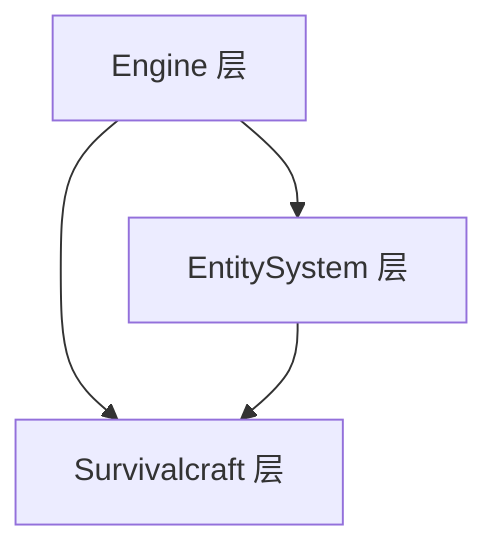
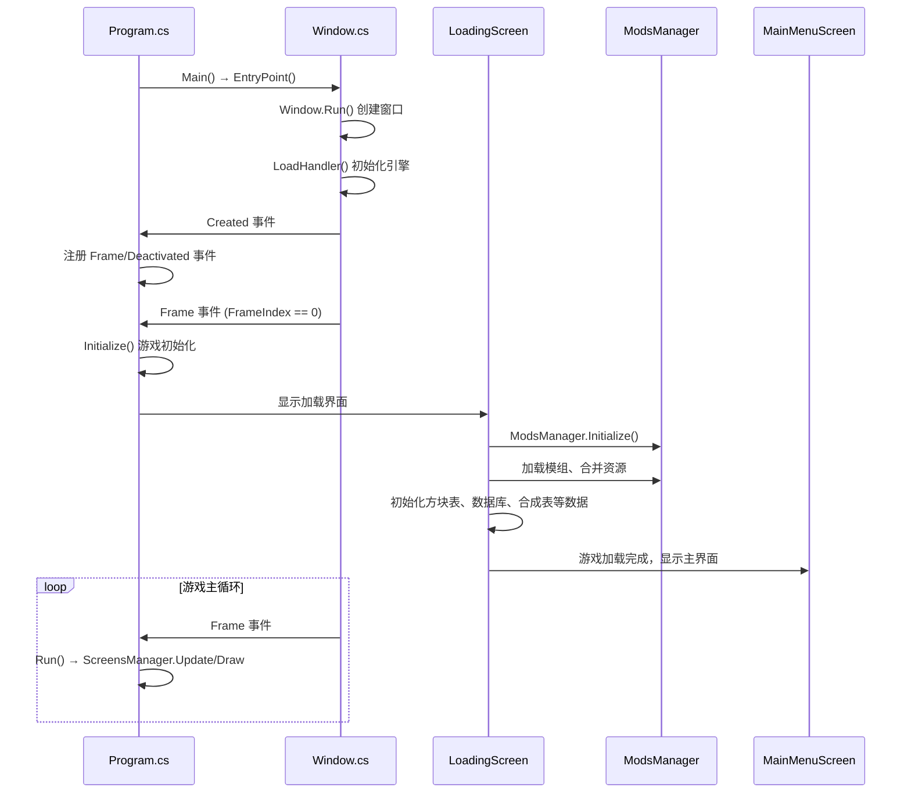
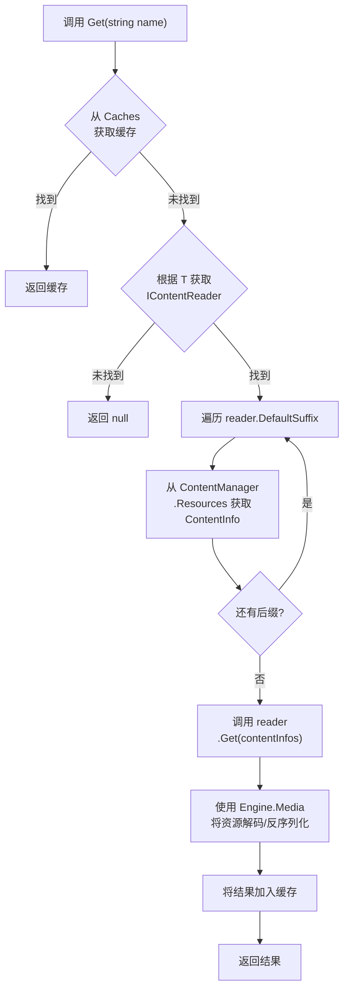
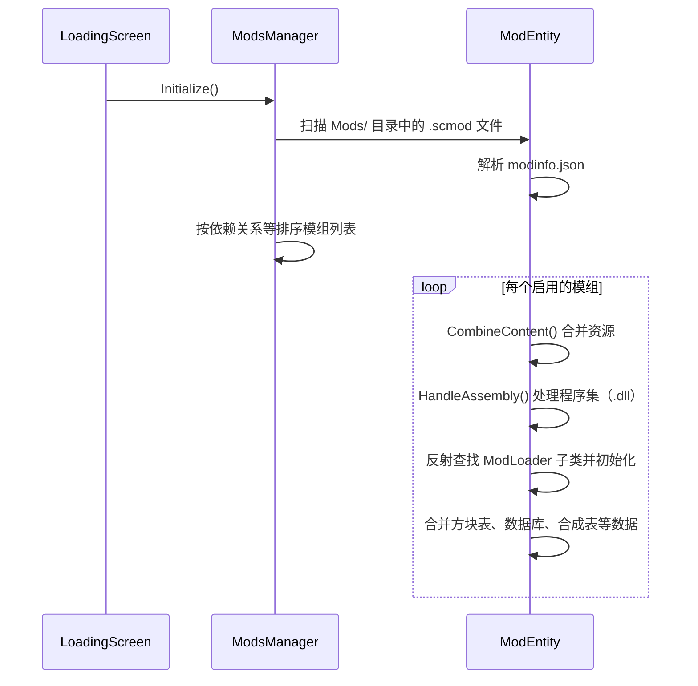

# Survivalcraft API 架构文档

本文档面向新加入项目的开发者和模组开发者（包括 AI Agent），帮助快速理解项目的整体架构和运行机制。

## 1. 项目技术概述

| 项目 | 说明 |
|------|------|
| **编程语言** | C# |
| **目标框架** | .NET 10 |
| **图形 API** | OpenGL ES 3.2（使用 Silk.NET 封装）|
| **窗口库** | 桌面端 GLFW，移动端 SDL |
| **目标平台** | Windows、Linux、Android、iOS、Browser（WebAssembly） |
| **游戏类型** | 3D 体素沙盒，野外生存，支持最多 4 人同屏 |
| **模组支持** | 资源覆盖、ModLoader 钩子、HarmonyX 方法注入、运行 Javascript |

## 2. 整体分层架构

项目采用三层架构设计，依赖关系自下而上：



### 层级职责

| 层级 | 职责 | 关键内容 |
|------|------|----------|
| **Engine** | 底层引擎服务 | 窗口管理、图形渲染、音频播放、输入处理、媒体解码、序列化 |
| **EntitySystem** | 实体系统框架 | Entity（实体）、Component（组件）、Subsystem（子系统）、模板数据库 |
| **Survivalcraft** | 游戏业务逻辑 | 方块定义、具体管理器/子系统/实体组件实现、UI 界面、模组支持 |

## 3. 目录结构速览

```
/workspace/
├── Engine/                      # 引擎核心代码（跨平台共享）
│   ├── Engine/                  # 核心模块：Window、Display、Log 等
│   ├── Engine.Audio/            # 音频播放
│   ├── Engine.Graphics/         # 图形渲染、着色器、纹理等
│   ├── Engine.Input/            # 键盘、鼠标、手柄、触摸屏输入
│   ├── Engine.Media/            # 解码图片、音频、模型等资源
│   └── Engine.Serialization/    # 数据序列化
│
├── Engine.平台/                 # 平台专属引擎代码（少量）
│
├── EntitySystem/                # 实体系统框架
│   ├── GameEntitySystem/        # Entity、Component、Subsystem、Project
│   └── TemplatesDatabase/       # 数据库模板、ValuesDictionary
│
├── EntitySystem.平台/           # 无平台专属代码
│
├── Survivalcraft/               # 游戏本体（跨平台共享）
│   ├── Content/Assets/          # 游戏资源（贴图、音频、模型、XML数据）
│   │   ├── Atlases/             # 精灵图集
│   │   ├── Audio/               # 音频资源
│   │   ├── Dialogs/             # 对话框布局
│   │   ├── Fonts/               # 字体
│   │   ├── Langs/               # 语言字符串
│   │   ├── Models/              # 模型资源
│   │   ├── Music/               # 音乐资源
│   │   ├── Screens/             # 全屏界面布局
│   │   ├── Shaders/             # 着色器
│   │   ├── Styles/              # 界面样式
│   │   ├── Textures/            # 纹理资源
│   │   ├── Widgets/             # 界面控件布局
│   │   │
│   │   ├── BlocksData.txt       # 方块表
│   │   ├── Clothes.xml          # 衣物数据
│   │   ├── Clothes.xsd          # 衣物数据的架构定义
│   │   ├── CraftingRecipes.xml  # 合成表
│   │   ├── CraftingRecipes.xsd  # 衣物数据的架构定义
│   │   ├── Database.xml         # 数据库
│   │   ├── Database.xsd         # 数据库的架构定义
│   │   ├── NewWorldNames.txt    # 新世界名称列表
│   │   └── RecoveryProject.xml  # 存档损坏后，用于尝试恢复的文件
│   │
│   ├── Block/                   # 全部方块定义
│   ├── Component/               # 实体组件实现
│   ├── ContentProvider/         # 内容提供器
│   ├── Dialog/                  # 对话框
│   ├── ElectricElement/         # 电路元件
│   ├── Game/Program.cs          # 程序入口
│   ├── IContentReader/          # 资源读取器
│   ├── Managers/                # 原版游戏就有的管理器
│   ├── ModsManager/             # 实现模组支持
│   ├── Screen/                  # 全屏界面
│   ├── Subsystem/               # 子系统实现
│   └── Widget/                  # 界面控件
│
├── Survivalcraft.平台/          # 平台专属游戏启动代码
│
├── build/                       # .props 构建属性文件
└── SurvivalcraftApi.sln         # 解决方案文件
```

> **提示**：在 IDE 中打开 `SurvivalcraftApi.sln`，你会看到每个平台有专门的目录，右键目录可方便地卸载不需要的所有平台项目。

## 4. 游戏启动流程



### 关键步骤说明

1. **程序入口** [Program.cs](../Survivalcraft/Game/Program.cs)
   - `Main()` 方法处理命令行参数（Windows 端）
   - 调用 `EntryPoint()` 进入游戏初始化

2. **窗口创建** [Window.cs](../Engine/Engine/Window.cs)
   - 使用 Silk.NET 创建跨平台窗口，初始化 OpenGL ES 上下文
   - 触发窗口 `Load` 事件，调用 `LoadHandler()` 进行引擎初始化和注册窗口事件
   - 触发窗口 `Render` 事件，首帧时开始游戏初始化

3. **游戏初始化** `Program.Initialize()`
   - 初始化 `SettingsManager`、`ScreensManager` 等管理器
   - 进入 `LoadingScreen`

4. **内容加载** [LoadingScreen](../Survivalcraft/Screen/LoadingScreen.cs)
   - 加载模组列表并排序
   - 合并资源，完成后正式开始渲染游戏画面
   - 合并方块表、数据库、合成表等数据
   - 初始化 `BlocksManager`、`DatabaseManager` 等管理器

5. **主循环** `Program.Run()`
   - 每帧调用 `ScreensManager.Update()` 和 `ScreensManager.Draw()`

## 5. 核心运行机制：ECS

游戏采用 ECS（Entity-Component-Subsystem）架构，但与典型 ECS 有所不同：

### 核心概念

| 概念 | 说明 | 实例获取方式 | 示例 |
|------|------|--------------|------|
| **Project** | 游戏世界的运行时实例 | `GameManager.Project` | / |
| **Entity** | 游戏实体，是 Component 的容器 | `Project.Entities` | 玩家、动物、箱子 |
| **Component** | 实体的行为和数据组件 | `Entity.FindComponent<T>()` | ComponentHealth、ComponentBody |
| **Subsystem** | 全局的子系统，管理某类功能，每个子系统只有一个实例 | `Project.FindSubsystem<T>()` | SubsystemTerrain、SubsystemTime |

### 数据驱动设计

实体和子系统的定义存储在数据库文件 `Database.xml` 中，模组也应将新的实体模板、组件、子系统注册进数据库

**加载流程**：
1. `Project` 根据存档中的 `Project.xml` 和 `DatabaseManager.GameDatabase` 进行实例化
2. 反射创建相应 `Subsystem` 列表和 `Entity` 列表
3. 每个 `Entity` 根据模板创建其 `Component` 列表
4. 上面具有 `IUpdatable` 接口的 `Subsystem` 和 `Component` 将加入 `SubsystemUpdate.m_updateables`，它们的 `Update` 方法将被每帧调用；具有 `IDrawable` 接口的同理

## 6. 跨平台策略

### 共享代码 + 平台项目

```
Engine/              # 99% 共享代码
Engine.Android/      # Android 专属
Engine.Browser/      # 浏览器 专属
……
```

### 条件编译

使用 `#if` 预处理指令处理平台差异，像这样：

```cs
#if ANDROID
using Android.Views;
#elif BROWSER
using Engine.Browser;
#elif WINDOWS
using NativeFileDialogCore;
#endif

#if WINDOWS
    // 仅 Windows 平台执行的代码
#endif
```

**常用编译符号**：

| 符号 | 平台 |
|------|------|
| `ANDROID` | Android 系统 |
| `BROWSER` | 全平台的浏览器（仅 Chrome），不支持模组 |
| `WINDOWS` | Windows 桌面系统 |
| `LINUX` | Linux 桌面系统 |
| `IOS` | iOS/iPadOS 系统，不支持模组中的程序集（`.dll`） |
| `MOBILE` | 等价于 `ANDROID \|\| IOS` |

另外，`Engine.Windows` 有个专门的使用 [Angle](https://github.com/google/angle) 的版本，通过它能实现游戏在原生不支持 `OpenGL ES` 的显卡驱动上运行；可以通过根目录的 `BuildEngineWindowsWithUseAngle.bat` 来构建

## 7. 资源管线

游戏加载过程会将 `Content.zip/Assets/` 和所有模组的 `*.scmod/Assets/` 合并到 `ContentManager<br/>.Resources` 中，具有相同路径的文件将按加载顺序覆盖  
游戏运行时，通过 `ContentManager.Get<T>(string name)` 方法来获取转换为指定类型的资源，大致流程如下



> `DefaultSuffix` 中越靠前的后缀，读取优先级越高  
> 该方法还有带后缀支持的重载，如果手动指定了后缀，将无视读取器的 `DefaultSuffix`  
> 大部分读取器只读取列表中第一个文件，部分读取器需要同时输入两个文件  

## 8. 模组系统

### 模组加载流程



### 模组数据合并

模组可以修改原版数据，通过特殊属性实现：

| 数据类型 | 游戏内文件 | 模组内文件 | 合并方式 |
|----------|------------|------------|----------|
| 方块表 | `BlocksData.txt` | `*.csv` | 追加新方块、类名相同时修改属性 |
| 衣物表 | `Clothes.xml` | `*.clo` | 按 Index 匹配，支持 `New-` 前缀修改多个属性、`Remove` 删除元素 |
| 合成表 | `CraftingRecipes.xml` | `*.cr` | 追加新合成配方，支持 `New-` 前缀修改单个属性、`Remove` 删除元素（需要其他每个属性都相同） |
| 数据库 | `Database.xml` | `*.xdb` | 追加新数据，按 Guid 匹配，支持 `New-` 前缀修改单个属性、`Remove` 删除元素 |
| 语言字符串 | `Lang/*.json` | 同左 | 追加新字符串，覆盖同路径字符串 |

### ModLoader 钩子系统

模组通过继承 [ModLoader](../Survivalcraft/ModsManager/ModLoader.cs) 类并重写方法来介入游戏逻辑：

```cs
public class TemplateModLoader : ModLoader {
    public override void __ModInitialize() {
        ModsManager.RegisterHook("OnLoadingFinished", this, 1);
    }

    // 必须在 __ModInitialize() 方法中注册，否则无效
    public override void OnLoadingFinished(List<Action> actions) {
        Log.Information("Survivalcraft Template Mod: Game Loaded. 来自生存战争示例模组：游戏已加载。");
    }
}
```

**钩子执行顺序**：
- 默认按模组加载顺序依次执行
- 使用 `RegisterHook(name, loader, priority)` 手动设置钩子的执行优先级
- 部分方法返回 `true` 可阻断后续模组执行

### HarmonyX 方法注入

详见 HarmonyX [官方文档](https://github.com/BepInEx/HarmonyX/wiki)

你可以在 `ModLoader.__ModInitialize()` 运行 `PatchAll()` 方法

```cs
public class TemplateModLoader : ModLoader {
    public override void __ModInitialize() {
        Harmony harmony = new Harmony("xfdz.SurvivalcraftTemplateMod");
        harmony.PatchAll();
    }
}
```

### 示例模组项目

[点此打开](https://gitee.com/SC-SPM/SurvivalcraftTemplateModForAPI)

## 9. 关键管理器速查

> 位置：[Survivalcraft/Managers](../Survivalcraft/Managers/)

| 管理器 | 职责 |
|--------|------|
| `ModsManager` | 模组加载、数据合并、Hook 分发 |
| `ScreensManager` | 界面切换、全屏界面管理 |
| `DialogsManager` | 对话框显示/隐藏 |
| `BlocksManager` | 方块注册与查询 |
| `DatabaseManager` | 实体/子系统模板数据库 |
| `CraftingRecipesManager` | 合成表管理 |
| `SettingsManager` | 游戏设置持久化 |
| `ContentManager` | 资源加载、资源获取 |
| `WorldsManager` | 加载存档列表，新建、导入、导出存档 |
| `GameManager` | 打开、运行、保存存档 |

## 10. 专项技术文档

* [生物模型系统](CreatureModelSystem.md) - 生物 3D 模型的骨骼、网格、动画、渲染
* [地形系统](TerrariaSystem.md) - 地形的数据结构、更新、生成、渲染、序列化、主动变更
* [UI 界面系统](UiSystem.md) - 游戏 UI 界面的管理器、布局流程、主要容器组件、使用示例