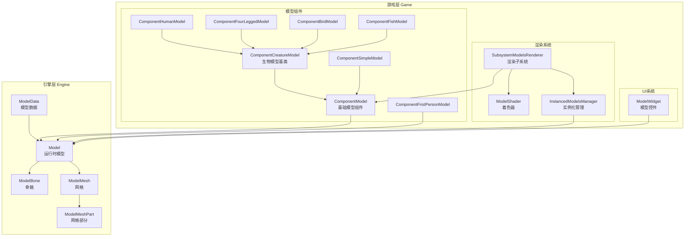
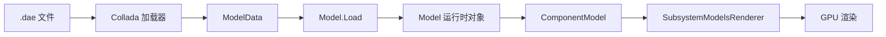
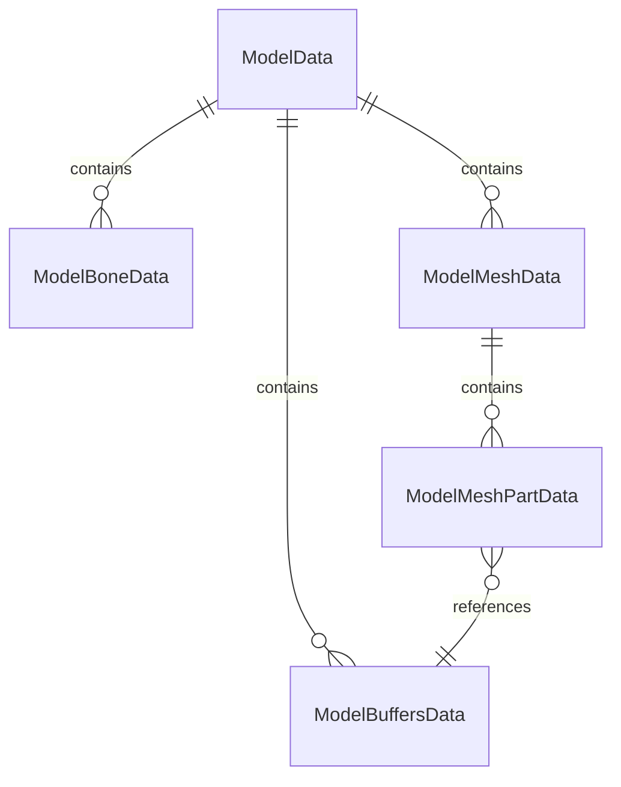
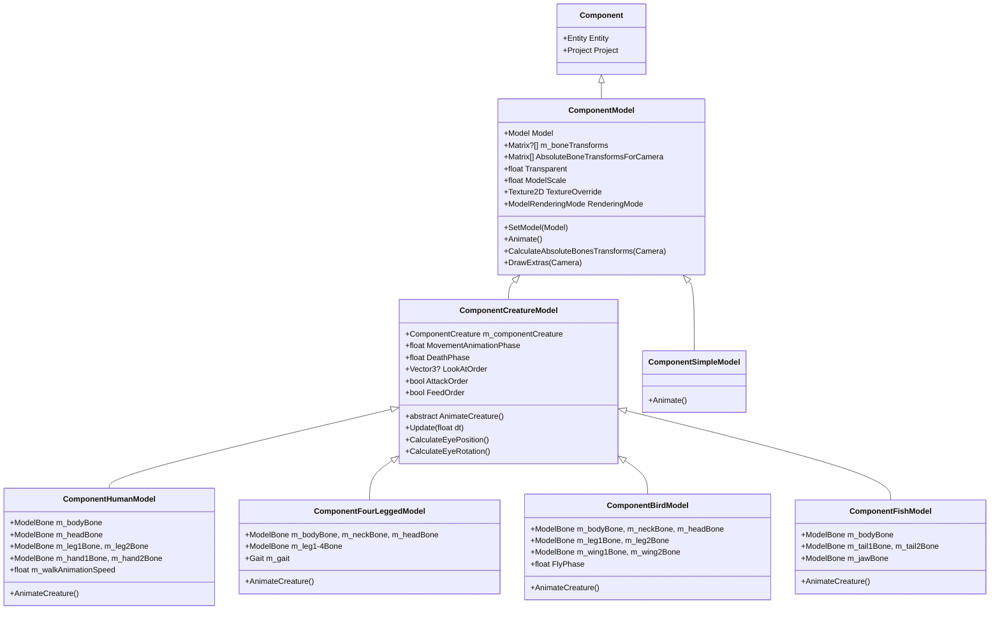
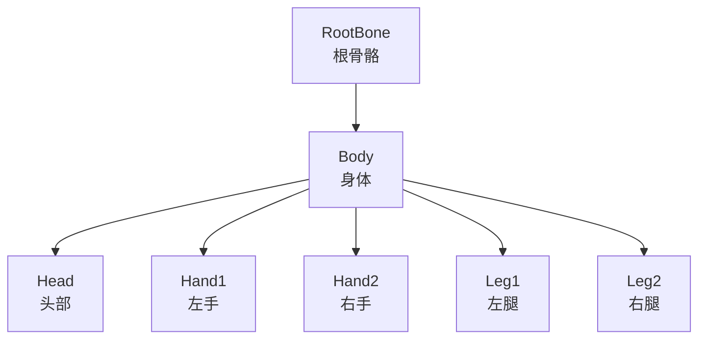
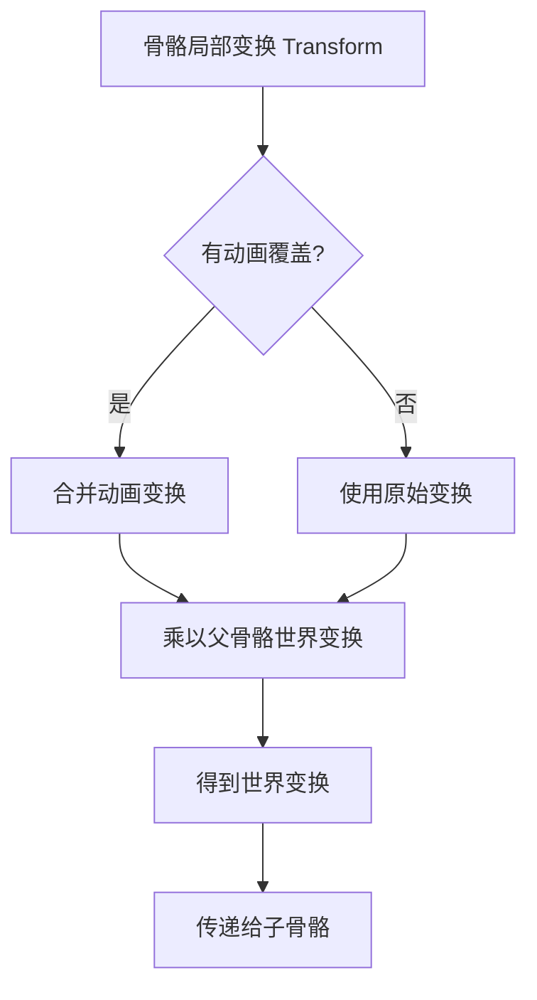
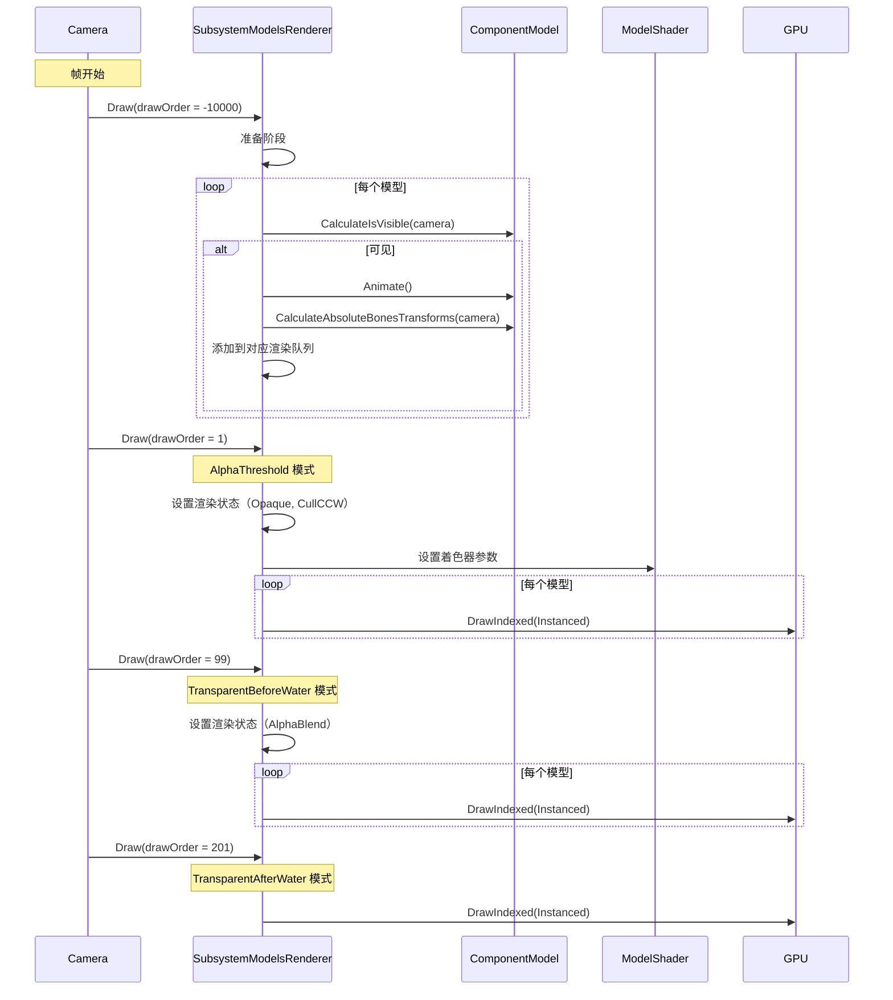

# 生物模型系统技术文档

本文档详细讲解 Survivalcraft 生物 3D 模型系统的整体架构、核心机制、数据结构及运行流程。

## 目录

1. [整体架构概览](#1-整体架构概览)
2. [核心数据结构](#2-核心数据结构)
3. [模型组件体系](#3-模型组件体系)
4. [骨骼动画机制](#4-骨骼动画机制)
5. [渲染管线](#5-渲染管线)
6. [实例化渲染优化](#6-实例化渲染优化)
7. [各类生物模型实现](#7-各类生物模型实现)
8. [UI模型显示](#8-ui模型显示)

---

## 1. 整体架构概览

### 1.1 系统架构图

模型系统采用分层架构，从底层引擎到游戏逻辑逐层封装：



### 1.2 核心模块职责

| 模块 | 层级 | 职责 |
|------|------|------|
| **Model** | 引擎层 | 运行时模型容器，管理骨骼层级和网格集合 |
| **ModelBone** | 引擎层 | 骨骼节点，树形结构存储变换矩阵 |
| **ModelMesh** | 引擎层 | 网格数据，关联到父骨骼，包含渲染数据 |
| **ComponentModel** | 游戏层 | Entity组件，管理单个模型的渲染状态 |
| **ComponentCreatureModel** | 游戏层 | 生物模型抽象基类，定义动画接口 |
| **SubsystemModelsRenderer** | 游戏层 | 模型渲染子系统，管理所有模型的绘制 |
| **ModelShader** | 游戏层 | 封装着色器参数，支持实例化渲染 |

### 1.3 数据流向



---

## 2. 核心数据结构

### 2.1 ModelData - 模型数据容器

`ModelData` 是模型文件的内存表示，用于序列化和反序列化：

```cs
public class ModelData {
    public List<ModelBoneData> Bones = [];      // 骨骼数据列表
    public List<ModelMeshData> Meshes = [];     // 网格数据列表
    public List<ModelBuffersData> Buffers = []; // 顶点/索引缓冲数据
}
```

**数据结构关系**：



### 2.2 ModelBoneData - 骨骼数据

```cs
public class ModelBoneData {
    public string Name;            // 骨骼名称
    public int ParentBoneIndex;    // 父骨骼索引（-1 表示根骨骼）
    public Matrix Transform;       // 局部变换矩阵
}
```

骨骼通过 `ParentBoneIndex` 建立树形层级关系。

### 2.3 ModelMeshData - 网格数据

```cs
public class ModelMeshData {
    public string Name;                        // 网格名称
    public int ParentBoneIndex;                // 关联的骨骼索引
    public List<ModelMeshPartData> MeshParts;  // 网格部分列表
    public BoundingBox BoundingBox;            // 包围盒
}
```

### 2.4 ModelMeshPartData - 网格部分数据

```cs
public class ModelMeshPartData {
    public int BuffersDataIndex;    // 缓冲数据索引
    public int StartIndex;          // 索引缓冲起始位置
    public int IndicesCount;        // 索引数量
    public BoundingBox BoundingBox; // 包围盒
}
```

### 2.5 ModelBuffersData - 缓冲数据

```cs
public class ModelBuffersData {
    public VertexDeclaration VertexDeclaration;  // 顶点声明
    public byte[] Vertices = [];                 // 顶点数据
    public byte[] Indices = [];                  // 索引数据
}
```

### 2.6 Model - 运行时模型

`Model` 是渲染使用的运行时模型对象：

```cs
public class Model : IDisposable {
    public ModelBone m_rootBone;                  // 根骨骼
    public List<ModelBone> m_bones = [];          // 所有骨骼（平铺）
    public List<ModelMesh> m_meshes = [];         // 所有网格
    public ModelData ModelData { get; set; }      // 源数据引用
    
    // 关键方法
    public ModelBone FindBone(string name, bool throwIfNotFound = true);
    public ModelMesh FindMesh(string name, bool throwIfNotFound = true);
    public ModelBone NewBone(string name, Matrix transform, ModelBone parentBone);
    public void CopyAbsoluteBoneTransformsTo(Matrix[] absoluteTransforms);
}
```

**模型加载流程**：

```cs
public static Model Load(ModelData modelData, bool keepSourceVertexDataInTags = false) {
    Model model = new();
    // 1. 创建 VertexBuffer 和 IndexBuffer
    VertexBuffer[] vertexBuffers = new VertexBuffer[modelData.Buffers.Count];
    IndexBuffer[] indexBuffers = new IndexBuffer[modelData.Buffers.Count];
    
    // 2. 构建骨骼层级
    foreach (ModelBoneData bone in modelData.Bones) {
        ModelBone parent = bone.ParentBoneIndex >= 0 ? m_bones[bone.ParentBoneIndex] : null;
        NewBone(bone.Name, bone.Transform, parent);
    }
    
    // 3. 构建网格和网格部分
    foreach (ModelMeshData mesh in modelData.Meshes) {
        ModelMesh modelMesh = NewMesh(mesh.Name, m_bones[mesh.ParentBoneIndex], mesh.BoundingBox);
        foreach (ModelMeshPartData part in mesh.MeshParts) {
            modelMesh.NewMeshPart(
                vertexBuffers[part.BuffersDataIndex],
                indexBuffers[part.BuffersDataIndex],
                part.StartIndex, part.IndicesCount, part.BoundingBox
            );
        }
    }
    return model;
}
```

### 2.7 ModelBone - 骨骼

```cs
public class ModelBone {
    public Model Model { get; set; }           // 所属模型
    public int Index { get; set; }             // 在骨骼列表中的索引
    public string Name { get; set; }           // 骨骼名称
    public Matrix Transform { get; set; }      // 局部变换矩阵
    public ModelBone ParentBone { get; set; }  // 父骨骼
    public ReadOnlyList<ModelBone> ChildBones; // 子骨骼列表
}
```

### 2.8 ModelMesh / ModelMeshPart - 网格

```cs
public class ModelMesh : IDisposable {
    public string Name { get; set; }           // 网格名称
    public ModelBone ParentBone { get; set; }  // 关联的骨骼
    public BoundingBox BoundingBox;            // 包围盒
    public ReadOnlyList<ModelMeshPart> MeshParts; // 网格部分列表
}

public class ModelMeshPart : IDisposable {
    public VertexBuffer VertexBuffer { get; set; }  // 顶点缓冲
    public IndexBuffer IndexBuffer { get; set; }    // 索引缓冲
    public int StartIndex { get; set; }             // 起始索引
    public int IndicesCount { get; set; }           // 索引数量
    public BoundingBox BoundingBox;                 // 包围盒
    public string TexturePath;                      // 纹理路径
}
```

---

## 3. 模型组件体系

### 3.1 继承层次



### 3.2 ComponentModel - 基础模型组件

`ComponentModel` 是所有模型组件的基类，提供核心功能：

```cs
public class ComponentModel : Component {
    // 核心属性
    public Model m_model;                              // 模型对象
    public Matrix?[] m_boneTransforms;                 // 骨骼局部变换（可空）
    public Matrix[] AbsoluteBoneTransformsForCamera;   // 骨骼世界变换
    public float m_boundingSphereRadius;               // 包围球半径
    
    // 渲染属性
    public float Transparent { get; set; }             // 透明度
    public float ModelScale { get; set; }              // 缩放
    public Vector3 ModelOffset { get; set; }           // 偏移
    public Texture2D TextureOverride { get; set; }     // 纹理覆盖
    public ModelRenderingMode RenderingMode { get; set; } // 渲染模式
    public bool CastsShadow { get; set; }              // 是否投射阴影
    
    // 状态
    public bool IsVisibleForCamera { get; set; }       // 是否可见
    public bool Animated { get; set; }                 // 是否已动画
}
```

**关键方法**：

```cs
// 设置骨骼变换（带缩放和偏移处理）
public virtual void SetBoneTransform(int boneIndex, Matrix? transformation) {
    bool canScale = boneIndex == Model.RootBone.Index;
    Matrix? tf = canScale ? Matrix.CreateScale(ModelScale) * transformation : transformation;
    m_boneTransforms[boneIndex] = tf * Matrix.CreateTranslation(ModelOffset);
}

// 计算骨骼世界变换（递归处理层级）
public virtual void ProcessBoneHierarchy(ModelBone bone, Matrix currentTransform, Matrix[] transforms) {
    Matrix m = bone.Transform;
    if (m_boneTransforms[bone.Index].HasValue) {
        // 应用动画变换
        Vector3 translation = m.Translation;
        m.Translation = Vector3.Zero;
        m *= m_boneTransforms[bone.Index].Value;
        m.Translation += translation;
        Matrix.MultiplyRestricted(ref m, ref currentTransform, out transforms[bone.Index]);
    } else {
        Matrix.MultiplyRestricted(ref m, ref currentTransform, out transforms[bone.Index]);
    }
    // 递归处理子骨骼
    foreach (ModelBone child in bone.ChildBones) {
        ProcessBoneHierarchy(child, transforms[bone.Index], transforms);
    }
}
```

### 3.3 ComponentCreatureModel - 生物模型基类

抽象类，为所有生物实体提供动画框架：

```cs
public abstract class ComponentCreatureModel : ComponentModel, IUpdateable {
    // 引用
    public ComponentCreature m_componentCreature;
    
    // 动画状态
    public float MovementAnimationPhase { get; set; }  // 移动动画相位
    public float DeathPhase { get; set; }              // 死亡相位
    public float Bob { get; set; }                     // 上下浮动
    
    // 行为指令
    public Vector3? LookAtOrder { get; set; }          // 注视目标
    public bool LookRandomOrder { get; set; }          // 随机注视
    public float HeadShakeOrder { get; set; }          // 摇头
    public bool AttackOrder { get; set; }              // 攻击
    public bool FeedOrder { get; set; }                // 进食
    
    // 抽象方法
    public abstract void AnimateCreature();            // 子类实现具体动画
}
```

**Update 方法** - 每帧更新动画状态：

```cs
public virtual void Update(float dt) {
    // 处理随机注视
    if (LookRandomOrder) {
        // 计算随机注视点...
        LookAtOrder = m_randomLookPoint;
    }
    
    // 处理注视指令
    if (LookAtOrder.HasValue) {
        // 计算朝向角度并设置 LookOrder...
    }
    
    // 处理摇头
    if (HeadShakeOrder > 0f) {
        HeadShakeOrder = MathUtils.Max(HeadShakeOrder - dt, 0f);
        // 应用摇头动画...
    }
    
    // 处理死亡
    if (m_componentCreature.ComponentHealth.Health == 0f) {
        DeathPhase = MathUtils.Min(DeathPhase + 3f * dt, 1f);
    }
}
```

---

## 4. 骨骼动画机制

### 4.1 骨骼层级与变换

骨骼动画基于层级变换，每个骨骼存储相对于父骨骼的局部变换：



**变换计算流程**：



### 4.2 骨骼变换覆盖机制

`ComponentModel.m_boneTransforms` 是可空矩阵数组，用于覆盖骨骼的局部变换：

```cs
// m_boneTransforms[boneIndex] 为 null：使用骨骼原始变换
// m_boneTransforms[boneIndex] 有值：使用覆盖变换

public virtual Matrix? GetBoneTransform(int boneIndex) {
    return m_boneTransforms[boneIndex];
}

public virtual void SetBoneTransform(int boneIndex, Matrix? transformation) {
    m_boneTransforms[boneIndex] = transformation * Matrix.CreateTranslation(ModelOffset);
}
```

### 4.3 世界变换计算

```cs
// 绝对变换计算（从根到叶）
public void CopyAbsoluteBoneTransformsTo(Matrix[] absoluteTransforms) {
    for (int i = 0; i < m_bones.Count; i++) {
        ModelBone bone = m_bones[i];
        if (bone.ParentBone == null) {
            // 根骨骼：直接使用局部变换
            absoluteTransforms[i] = bone.Transform;
        } else {
            // 子骨骼：局部变换 × 父骨骼世界变换
            Matrix.MultiplyRestricted(
                ref bone.m_transform,
                ref absoluteTransforms[bone.ParentBone.Index],
                out absoluteTransforms[i]
            );
        }
    }
}
```

---

## 5. 渲染管线

### 5.1 SubsystemModelsRenderer 架构

`SubsystemModelsRenderer` 是模型渲染的核心子系统：

```cs
public class SubsystemModelsRenderer : Subsystem, IDrawable {
    // 模型数据缓存
    public Dictionary<ComponentModel, ModelData> m_componentModels = [];
    
    // 渲染队列（按渲染模式分组）
    public List<ModelData>[] m_modelsToDraw = [[], [], [], []];  // 4种模式
    
    // 着色器
    public static ModelShader ShaderOpaque;
    public static ModelShader ShaderAlphaTested;
    
    // 绘制顺序
    public int[] m_drawOrders = [-10000, 1, 99, 201];
}
```

### 5.2 渲染流程



### 5.3 渲染模式

```cs
public enum ModelRenderingMode {
    Solid,                    // 不透明
    AlphaThreshold,           // Alpha测试（如叶子）
    TransparentBeforeWater,   // 水前透明
    TransparentAfterWater     // 水后透明
}
```

**渲染模式选择逻辑**：

```cs
// ComponentCreatureModel.Animate()
if (Opacity.HasValue && Opacity.Value < 1f) {
    bool inWater = m_componentCreature.ComponentBody.ImmersionFactor >= 1f;
    bool viewUnderWater = m_subsystemSky.ViewUnderWaterDepth > 0f;
    
    // 根据相机和实体是否在水中选择透明模式
    RenderingMode = (inWater == viewUnderWater) 
        ? ModelRenderingMode.TransparentAfterWater 
        : ModelRenderingMode.TransparentBeforeWater;
} else {
    RenderingMode = ModelRenderingMode.Solid;
}
```

### 5.4 着色器参数

`ModelShader` 封装了模型渲染所需的所有着色器参数：

```cs
public class ModelShader : TransformedShader {
    // 变换矩阵（支持实例化）
    public ShaderParameter m_worldMatrixParameter;
    public ShaderParameter m_worldViewProjectionMatrixParameter;
    
    // 材质
    public ShaderParameter m_materialColorParameter;    // 材质颜色
    public ShaderParameter m_emissionColorParameter;    // 自发光颜色
    public ShaderParameter m_alphaThresholdParameter;   // Alpha阈值
    
    // 光照
    public ShaderParameter m_ambientLightColorParameter;
    public ShaderParameter m_diffuseLightColor1Parameter;
    public ShaderParameter m_directionToLight1Parameter;
    public ShaderParameter m_diffuseLightColor2Parameter;
    public ShaderParameter m_directionToLight2Parameter;
    
    // 雾效
    public ShaderParameter m_fogColorParameter;
    public ShaderParameter m_fogBottomTopDensityParameter;
    public ShaderParameter m_hazeStartDensityParameter;
    public ShaderParameter m_fogYMultiplierParameter;
    public ShaderParameter m_worldUpParameter;
    
    // 纹理
    public ShaderParameter m_textureParameter;
    public ShaderParameter m_samplerStateParameter;
}
```

### 5.5 顶点着色器核心逻辑

```hlsl
// Model.vsh 核心代码
void main() {
    int instance = int(a_instance);
    
    // 法线变换到世界空间
    vec3 worldNormal = normalize(vec3(u_worldMatrix[instance] * vec4(a_normal, 0.0)));
    
    // 光照计算（双光源）
    vec3 lightColor = u_ambientLightColor;
    lightColor += u_diffuseLightColor1 * max(dot(u_directionToLight1, worldNormal), 0.0);
    lightColor += u_diffuseLightColor2 * max(dot(u_directionToLight2, worldNormal), 0.0);
    v_color = vec4(lightColor, 1) * u_materialColor;
    
    // 自发光
    v_color += u_emissionColor;
    
    // 雾效计算
    v_fog = calculateFog(a_position, instance);
    
    // 位置变换
    gl_Position = u_worldViewProjectionMatrix[instance] * vec4(a_position, 1.0);
}
```

---

## 6. 实例化渲染优化

### 6.1 设计目标

传统方式每个模型单独绘制 DrawCall，实例化渲染将相同模型的多个实例合并为一个 DrawCall。

### 6.2 InstancedModelData 数据结构

```cs
public class InstancedModelData {
    // 实例化顶点声明（添加 Instance 语义）
    public static readonly VertexDeclaration VertexDeclaration = new(
        new VertexElement(0, VertexElementFormat.Vector3, VertexElementSemantic.Position),
        new VertexElement(12, VertexElementFormat.Vector3, VertexElementSemantic.Normal),
        new VertexElement(24, VertexElementFormat.Vector2, VertexElementSemantic.TextureCoordinate),
        new VertexElement(32, VertexElementFormat.Single, VertexElementSemantic.Instance)  // 骨骼索引
    );
    
    public VertexBuffer VertexBuffer;
    public IndexBuffer IndexBuffer;
}
```

### 6.3 实例化数据创建

`InstancedModelsManager` 将普通模型转换为实例化格式：

```cs
public static InstancedModelData CreateInstancedModelData(Model model, int[] meshDrawOrders) {
    DynamicArray<InstancedVertex> vertices = new();
    DynamicArray<int> indices = new();
    
    foreach (int meshIndex in meshDrawOrders) {
        ModelMesh mesh = model.Meshes[meshIndex];
        foreach (ModelMeshPart part in mesh.MeshParts) {
            // 读取原始顶点数据
            SourceModelVertex[] srcVertices = GetVertexData(part.VertexBuffer);
            int[] srcIndices = GetIndexData(part.IndexBuffer);
            
            // 转换为实例化顶点
            for (int i = part.StartIndex; i < part.StartIndex + part.IndicesCount; i++) {
                int srcIdx = srcIndices[i];
                InstancedVertex v;
                v.X = srcVertices[srcIdx].X;
                v.Y = srcVertices[srcIdx].Y;
                v.Z = srcVertices[srcIdx].Z;
                v.Nx = srcVertices[srcIdx].Nx;
                v.Ny = srcVertices[srcIdx].Ny;
                v.Nz = srcVertices[srcIdx].Nz;
                v.Tx = srcVertices[srcIdx].Tx;
                v.Ty = srcVertices[srcIdx].Ty;
                v.Instance = mesh.ParentBone.Index;  // 骨骼索引作为实例 ID
                vertices.Add(v);
            }
        }
    }
    
    // 创建 GPU 缓冲
    return new InstancedModelData {
        VertexBuffer = new VertexBuffer(VertexDeclaration, vertices.Count),
        IndexBuffer = new IndexBuffer(IndexFormat.ThirtyTwoBits, indices.Count)
    };
}
```

### 6.4 实例化渲染流程

```mermaid
flowchart TD
    A[获取 InstancedModelData] --> B[设置骨骼世界变换数组]
    B --> C[设置材质/光照参数]
    C --> D[单次 DrawIndexed 调用]
    D --> E[着色器根据 Instance ID 选择变换矩阵]
    
    subgraph "着色器内部"
        E --> F[顶点 × WorldMatrix[instance]]
        F --> G[输出到屏幕]
    end
```

---

## 7. 各类生物模型实现

### 7.1 ComponentHumanModel - 人形模型

人形模型包含头部、身体、双手、双腿六个可动部位：

```cs
public class ComponentHumanModel : ComponentCreatureModel {
    // 骨骼引用
    public ModelBone m_bodyBone, m_headBone;
    public ModelBone m_leg1Bone, m_leg2Bone;
    public ModelBone m_hand1Bone, m_hand2Bone;
    
    // 动画参数
    public float m_walkAnimationSpeed;    // 行走动画速度
    public float m_walkLegsAngle;         // 腿部摆动角度
    public float m_walkBobHeight;         // 上下浮动高度
    
    // 状态
    public float m_sneakFactor;           // 潜行系数
    public float m_lieDownFactorModel;    // 躺下系数
    public float m_punchFactor;           // 出拳系数
    public float m_punchPhase;            // 出拳相位
}
```

**AnimateCreature 核心逻辑**：

```cs
public override void AnimateCreature() {
    Vector3 position = m_componentCreature.ComponentBody.Position;
    Vector3 rotation = m_componentCreature.ComponentBody.Rotation.ToYawPitchRoll();
    
    if (m_lieDownFactorModel == 0f) {
        // 正常站立/行走状态
        float sinPhase = MathF.Sin(MathF.PI * 2f * MovementAnimationPhase);
        
        // 头部角度（看向方向 + 噪声抖动）
        float headX = Clamp(lookAngles.X + turnOrder + headingOffset, -80°, 80°);
        float headY = Clamp(lookAngles.Y + noise, -45°, 45°);
        
        // 手臂角度（行走摆动 + 攻击 + 划船）
        float hand1X = -0.5f * sinPhase + punchAngle + rowAngle;
        float hand2X = 0.5f * sinPhase + punchAngle + aimAngle;
        
        // 腿部角度（行走摆动）
        float leg1X = m_walkLegsAngle * sinPhase;
        float leg2X = -leg1X;
        
        // 应用骨骼变换
        SetBoneTransform(m_bodyBone.Index, Matrix.CreateRotationY(rotation.X) * Matrix.CreateTranslation(position));
        SetBoneTransform(m_headBone.Index, Matrix.CreateRotationX(headY) * Matrix.CreateRotationZ(-headX));
        SetBoneTransform(m_hand1Bone.Index, Matrix.CreateRotationY(hand1Y) * Matrix.CreateRotationX(hand1X));
        SetBoneTransform(m_hand2Bone.Index, Matrix.CreateRotationY(hand2Y) * Matrix.CreateRotationX(hand2X));
        SetBoneTransform(m_leg1Bone.Index, Matrix.CreateRotationX(leg1X));
        SetBoneTransform(m_leg2Bone.Index, Matrix.CreateRotationX(leg2X));
    } else {
        // 躺下/死亡状态
        float deathFactor = MathUtils.Max(DeathPhase, m_lieDownFactorModel);
        // ... 躺倒动画
    }
}
```

### 7.2 ComponentFourLeggedModel - 四足动物模型

支持三种步态：行走(Walk)、快走(Trot)、奔跑(Canter)：

```cs
public class ComponentFourLeggedModel : ComponentCreatureModel {
    public enum Gait { Walk, Trot, Canter }
    
    // 骨骼
    public ModelBone m_bodyBone, m_neckBone, m_headBone;
    public ModelBone m_leg1Bone, m_leg2Bone, m_leg3Bone, m_leg4Bone;
    
    // 步态
    public Gait m_gait;
    public float m_walkFrontLegsAngle;    // 前腿摆动角度
    public float m_walkHindLegsAngle;     // 后腿摆动角度
    public float m_canterLegsAngleFactor; // 奔跑角度系数
}
```

**步态判断**：

```cs
public override void Update(float dt) {
    float speed = Vector3.Dot(velocity, forward);
    
    if (m_canCanter && speed > 0.7f * WalkSpeed) {
        m_gait = Gait.Canter;        // 奔跑
        MovementAnimationPhase += speed * dt * 0.7f * m_walkAnimationSpeed;
    } else if (m_canTrot && speed > 0.5f * WalkSpeed) {
        m_gait = Gait.Trot;          // 快走
        MovementAnimationPhase += speed * dt * m_walkAnimationSpeed;
    } else if (MathF.Abs(speed) > 0.2f) {
        m_gait = Gait.Walk;          // 行走
        MovementAnimationPhase += speed * dt * m_walkAnimationSpeed;
    }
}
```

**不同步态的腿部相位**：

| 步态 | 腿1 | 腿2 | 腿3 | 腿4 | 说明 |
|------|-----|-----|-----|-----|------|
| Walk | 0° | 180° | 90° | 270° | 对角交替 |
| Trot | 0° | 180° | 180° | 0° | 同侧同步 |
| Canter | 0° | 90° | 54° | 144° | 跑步节奏 |

### 7.3 ComponentBirdModel - 鸟类模型

支持飞行和地面行走：

```cs
public class ComponentBirdModel : ComponentCreatureModel {
    // 骨骼
    public ModelBone m_bodyBone, m_neckBone, m_headBone;
    public ModelBone m_leg1Bone, m_leg2Bone;
    public ModelBone m_wing1Bone, m_wing2Bone;  // 可选
    
    // 飞行
    public float FlyPhase { get; set; }
    public float m_flyAnimationSpeed;
    
    // 豚食
    public float m_peckPhase;
    public float m_peckAnimationSpeed;
}
```

**飞行动画**：

```cs
public override void AnimateCreature() {
    // 翅膀扇动
    float wingAngle = 0f;
    if (m_hasWings) {
        wingAngle = 1.2f * MathF.Sin(MathF.PI * 2f * (FlyPhase + 0.75f));
        if (isOnGround) {
            wingAngle += 0.3f * MathF.Sin(MathF.PI * 2f * MovementAnimationPhase);
        }
    }
    
    // 腿部
    float leg1Angle, leg2Angle;
    if (isOnGround || inWater) {
        leg1Angle = 0.6f * MathF.Sin(MathF.PI * 2f * MovementAnimationPhase);
        leg2Angle = -leg1Angle;
    } else {
        leg1Angle = leg2Angle = -60°;  // 飞行时收起
    }
    
    // 应用变换
    SetBoneTransform(m_wing1Bone.Index, Matrix.CreateRotationY(wingAngle));
    SetBoneTransform(m_wing2Bone.Index, Matrix.CreateRotationY(-wingAngle));
}
```

### 7.4 ComponentFishModel - 鱼类模型

支持游泳、转向、挖掘行为：

```cs
public class ComponentFishModel : ComponentCreatureModel {
    public ModelBone m_bodyBone;
    public ModelBone m_tail1Bone, m_tail2Bone;  // 尾部两节
    public ModelBone m_jawBone;                  // 可选，嘴部
    
    public bool m_hasVerticalTail;   // 垂直尾（鲨鱼）vs 水平尾
    public float m_swimAnimationSpeed;
    
    public float? BendOrder { get; set; }  // 转向指令
    public float DigInOrder { get; set; }  // 挖掘深度
}
```

**尾部动画**：

```cs
public override void AnimateCreature() {
    // 尾部摆动（水平尾 vs 垂直尾）
    float tail1Z, tail1X, tail2Z, tail2X;
    if (m_hasVerticalTail) {
        // 垂直尾（左右摆动）
        tail1Z = 25° * Sin(phase) - turnX;
        tail2Z = 30° * Sin(phase - 0.25) - turnX;
        tail1X = 25° * Sin(swimPhase) - turnY;
        tail2X = 30° * Sin(swimPhase - 0.25) - turnY;
    } else {
        // 水平尾（上下摆动）
        tail1Z = 25° * Sin(swimPhase + tailWag) - turnX;
        tail2Z = 30° * Sin(swimPhase + tailWag - 0.25) - turnX;
        tail1X = -turnY;
        tail2X = -turnY;
    }
    
    // 嘴部咬合
    float jawAngle = 0f;
    if (m_bitingPhase > 0f) {
        jawAngle = -30° * MathF.Sin(MathF.PI * m_bitingPhase);
    }
}
```

### 7.5 ComponentSimpleModel - 简单模型

用于非生物实体，无复杂动画：

```cs
public class ComponentSimpleModel : ComponentModel {
    public override void Animate() {
        base.Animate();
        if (Animated) return;
        
        // 生成/消失透明度
        if (m_componentSpawn != null) {
            Opacity = CalculateSpawnOpacity();
        }
        
        // 直接使用实体矩阵
        SetBoneTransform(Model.RootBone.Index, m_componentFrame.Matrix);
    }
}
```

### 7.6 ComponentFirstPersonModel - 第一人称模型

专门处理玩家第一人称视角的手部渲染：

```cs
public class ComponentFirstPersonModel : Component, IDrawable, IUpdateable {
    public Model m_handModel;            // 手部模型
    public float m_swapAnimationTime;    // 物品切换动画
    public float m_pokeAnimationTime;    // 挖掘动画
    public Vector3 m_itemOffset;         // 物品偏移
    public Vector3 m_itemRotation;       // 物品旋转
    
    // 手部延迟（视角快速转动时的惯性效果）
    public Vector2 m_lagAngles;
}
```

**绘制逻辑**：

```cs
public virtual void Draw(Camera camera, int drawOrder) {
    // 缩小深度范围，避免与场景深度冲突
    Viewport viewport = Display.Viewport;
    viewport.MaxDepth *= 0.1f;
    Display.Viewport = viewport;
    
    // 计算手部变换
    Matrix transform = Matrix.Identity;
    
    // 物品切换动画
    if (m_swapAnimationTime > 0f) {
        float t = MathF.Pow(MathF.Sin(m_swapAnimationTime * PI), 3f);
        transform *= Matrix.CreateTranslation(0, -0.8f * t, 0.2f * t);
    }
    
    // 挖掘动画
    if (m_pokeAnimationTime > 0f) {
        float t = MathF.Sin(MathF.Sqrt(m_pokeAnimationTime) * PI);
        transform *= Matrix.CreateRotationX(-90° * t);
    }
    
    // 根据是否有物品选择绘制方式
    if (m_value != 0 && !ForceDrawHandOnly) {
        // 绘制手持方块
        Block.DrawBlock(...);
    } else {
        // 绘制手部模型
        foreach (ModelMesh mesh in m_handModel.Meshes) {
            Display.DrawIndexed(...);
        }
    }
}
```

---

## 8. UI模型显示

### 8.1 ModelWidget 结构

`ModelWidget` 用于在 UI 界面中显示 3D 模型：

```cs
public class ModelWidget : Widget {
    // 多模型支持
    public List<Model> Models = new();
    public Dictionary<Model, Matrix?[]> m_boneTransforms;
    public Dictionary<Model, Matrix[]> m_absoluteBoneTransforms;
    public Dictionary<Model, Texture2D> Textures;
    
    // 视图参数
    public bool IsPerspective { get; set; }        // 透视/正交
    public Vector3 ViewPosition { get; set; }      // 相机位置
    public Vector3 ViewTarget { get; set; }        // 观察目标
    public float ViewFov { get; set; }             // 视场角
    public Vector3 OrthographicFrustumSize;        // 正交范围
    
    // 自动旋转
    public Vector3 AutoRotationVector { get; set; }
    
    // 自定义着色器
    public TransformedShader CustomShader { get; set; }
    public Action<ModelWidget, Shader, Model, ModelMesh> OnSetupShaderParameters;
}
```

### 8.2 绘制流程

```cs
public override void Draw(DrawContext dc) {
    // 1. 选择着色器
    TransformedShader shader = CustomShader ?? (UseAlphaThreshold ? m_shaderAlpha : m_shader);
    
    // 2. 设置视图矩阵
    shader.Transforms.View = Matrix.CreateLookAt(ViewPosition, ViewTarget, Vector3.UnitY);
    
    // 3. 设置投影矩阵
    if (IsPerspective) {
        shader.Transforms.Projection = Matrix.CreatePerspectiveFieldOfView(ViewFov, aspect, 0.1f, 100f);
    } else {
        shader.Transforms.Projection = Matrix.CreateOrthographic(...);
    }
    
    // 4. 计算骨骼变换
    foreach (Model model in Models) {
        ProcessBoneHierarchy(model.RootBone, Matrix.Identity);
    }
    
    // 5. 绘制每个模型
    foreach (Model model in Models) {
        foreach (ModelMesh mesh in model.Meshes) {
            shader.Transforms.World[0] = m_absoluteBoneTransforms[mesh.ParentBone.Index];
            foreach (ModelMeshPart part in mesh.MeshParts) {
                Display.DrawIndexed(...);
            }
        }
    }
}
```

---

## 附录：模型骨骼命名约定

| 模型类型 | 骨骼名称 | 说明 |
|----------|----------|------|
| Human | Body, Head, Hand1, Hand2, Leg1, Leg2 | 人形六骨骼 |
| FourLegged | Body, Neck(可选), Head, Leg1-4 | 四足五/六骨骼 |
| Bird | Body, Neck, Head, Leg1, Leg2, Wing1(可选), Wing2(可选) | 鸟类五/七骨骼 |
| Fish | Body, Tail1, Tail2, Jaw(可选) | 鱼类三/四骨骼 |

---

## 总结

Survivalcraft 生物模型系统是一个完整的骨骼动画渲染框架：

1. **分层设计**：引擎层（Model/Bone/Mesh）与游戏层（Component）分离
2. **骨骼动画**：基于层级变换的骨骼系统，支持任意数量的骨骼
3. **组件化**：不同生物类型通过继承 ComponentCreatureModel 实现定制动画
4. **实例化渲染**：通过 GPU 实例化大幅减少 Draw Call
5. **双光源光照**：支持环境光 + 双方向光
6. **雾效集成**：高度雾和距离雾的完整支持
7. **Mod 扩展**：所有关键方法都预留了 Mod 钩子

理解这些机制，有助于添加新的生物类型、实现自定义动画、或进行性能优化。
