# 地形系统技术文档

本文档详细讲解 Survivalcraft 地形系统的整体架构、核心机制、数据结构及运行流程。

## 目录

1. [整体架构概览](#1-整体架构概览)
2. [核心数据结构](#2-核心数据结构)
3. [地形更新与生成机制](#3-地形更新与生成机制)
4. [地形编辑机制](#4-地形编辑机制)
5. [地形渲染机制](#5-地形渲染机制)
6. [地形序列化与存储](#6-地形序列化与存储)
7. [核心流程图](#7-核心流程图)
8. [生物群系生成机制](#8-生物群系生成机制)

---

## 1. 整体架构概览

### 1.1 系统架构图

地形系统采用分层架构设计，各模块职责清晰：

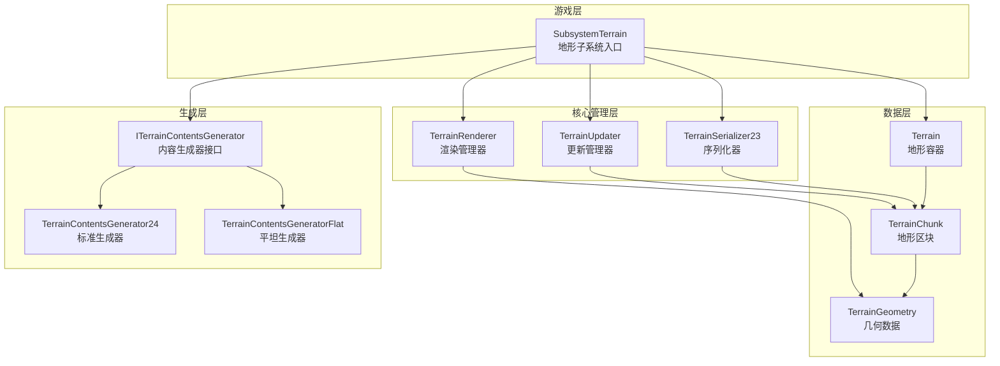

### 1.2 核心模块职责

| 模块 | 职责 | 关键特性 |
|------|------|----------|
| **SubsystemTerrain** | 地形系统入口，整合所有地形功能 | 实现 `IUpdateable` 和 `IDrawable`，管理射线检测、方块变更通知 |
| **Terrain** | 地形数据容器，管理所有 Chunk | 使用哈希表存储 Chunk，提供坐标转换和单元格访问接口 |
| **TerrainChunk** | 地形区块，存储实际方块数据 | 16×16×256 单元格，包含温度/湿度/高度等 Shaft 数据 |
| **TerrainUpdater** | 地形更新管理器 | 多线程更新，状态机驱动，优先级调度 |
| **TerrainRenderer** | 地形渲染器 | 分 Pass 渲染（不透明/Alpha测试/透明），支持雾效淡入 |
| **TerrainSerializer23** | 地形序列化器 | RLE 压缩 + Deflate 压缩，区域文件存储 |
| **ITerrainContentsGenerator** | 地形内容生成器接口 | 四阶段生成，支持不同生成模式 |

### 1.3 Chunk 状态机

地形区块的状态转换是理解整个地形系统的关键：

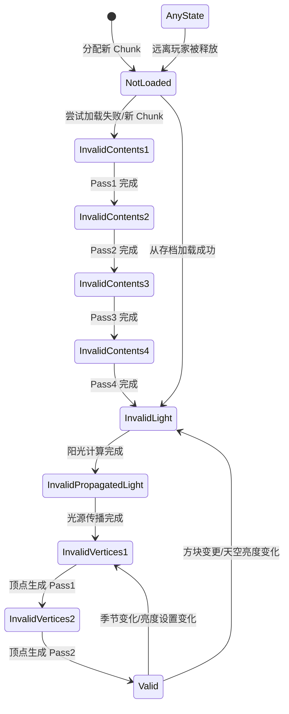

**状态说明**：

| 状态 | 含义 | 触发条件 |
|------|------|----------|
| `NotLoaded` | 未加载 | Chunk 刚分配或加载失败 |
| `InvalidContents1-4` | 内容无效（四阶段） | 需要生成地形内容 |
| `InvalidLight` | 光照无效 | 需要重新计算阳光和高度 |
| `InvalidPropagatedLight` | 传播光照无效 | 需要传播光源 |
| `InvalidVertices1-2` | 顶点无效 | 需要重新生成渲染网格 |
| `Valid` | 完全有效 | 可以正常渲染 |

---

## 2. 核心数据结构

### 2.1 Terrain - 地形容器

`Terrain` 是地形系统的顶层容器，负责管理所有 `TerrainChunk`：

```cs
public class Terrain : IDisposable {
    // Chunk 存储结构（开放寻址哈希表）
    public class ChunksStorage {
        public const int Capacity = 65536;        // 最大 Chunk 数量
        public TerrainChunk[] m_array;             // 哈希表数组
    }
    
    public ChunksStorage m_allChunks;              // 所有 Chunk 的存储
    public HashSet<TerrainChunk> m_allocatedChunks; // 已分配的 Chunk 集合
    
    // 单元格值编码常量
    public const int ContentsMask = 1023;    // 低 10 位：方块 ID
    public const int LightMask = 15360;      // 4 位：光照值
    public const int DataMask = -16384;      // 高 18 位：方块数据
}
```

**关键方法**：

- `GetChunkAtCell(x, y, z)` - 根据世界坐标获取 Chunk
- `GetCellValue(x, y, z)` - 获取单元格完整值（带边界检查）
- `GetCellValueFast(x, y, z)` - 快速获取单元格值（无边界检查）
- `SetCellValueFast(x, y, z, value)` - 快速设置单元格值

**坐标转换**：

```cs
// 世界坐标 -> Chunk 坐标
chunkX = x >> TerrainChunk.SizeBits;  // SizeBits = 4
chunkZ = z >> TerrainChunk.SizeBits;

// 世界坐标 -> Chunk 内坐标
localX = x & 0xF;  // 等价于 x % 16
localZ = z & 0xF;
```

### 2.2 TerrainChunk - 地形区块

`TerrainChunk` 是地形系统的核心数据单元：

```cs
public class TerrainChunk : IDisposable {
    // 尺寸常量
    public const int SizeBits = 4;          // 16 = 2^4
    public const int Size = 16;             // Chunk 水平尺寸
    public const int HeightBits = 8;        // 256 = 2^8
    public const int Height = 256;          // Chunk 高度
    public const int SliceHeight = 16;      // 切片高度
    public const int SlicesCount = 16;      // 切片数量（256/16）
    
    // 核心数据
    public Terrain Terrain;                 // 所属地形
    public Point2 Coords;                   // Chunk 坐标
    public Point2 Origin;                   // 世界原点坐标
    public BoundingBox BoundingBox;         // 包围盒
    
    // 方块数据（使用对象池缓存）
    public int[] Cells;                     // 65536 个单元格值
    public int[] Shafts;                    // 256 个 Shaft 值（温度/湿度/高度）
    
    // 渲染数据
    public TerrainChunkGeometry Geometry;
    public TerrainGeometry[] ChunkSliceGeometries; // 16 个切片几何
    public DynamicArray<TerrainChunkGeometry.Buffer> Buffers;
    
    // 状态
    public TerrainChunkState State;         // 主线程状态
    public TerrainChunkState ThreadState;   // 更新线程状态
    public volatile bool NewGeometryData;   // 新几何数据标志
}
```

**单元格索引计算**：

源码中有两种实现方式：

```cs
// 方式1：位运算（用于 CalculateCellIndex，支持超范围 Y 坐标）
public static int CalculateCellIndex(int x, int y, int z) {
    return y | (x << HeightBits) | (z << 12);  // HeightBits=8, 12=8+4
}

// 方式2：乘法运算（用于 GetCellValueFast/SetCellValueFast）
public int GetCellValueFast(int x, int y, int z) {
    return Cells[y + x * Height + z * Height * Size];  // Height=256, Size=16
}
```

两种方式数学上等价。

**Shaft 值编码**（每列一个，存储环境信息）：

Shaft 值的位布局

| 31-24 | 23-16 | 15-12 | 11-8 | 7-0 |
|-------|-------|-------|------|-----|
| SunlightHeight | BottomHeight | Humidity | Temperature | TopHeight |

```cs
int shaftValue = GetShaftValue(x, z);
int topHeight = ExtractTopHeight(shaftValue);      // 地表高度
int bottomHeight = ExtractBottomHeight(shaftValue); // 底部高度
int sunlightHeight = ExtractSunlightHeight(shaftValue); // 阳光穿透高度
int temperature = ExtractTemperature(shaftValue);   // 温度
int humidity = ExtractHumidity(shaftValue);         // 湿度
```

### 2.3 单元格值编码

每个单元格使用 32 位整数存储完整的方块信息：

单元格值位布局

| 31-14 | 13-10 | 9-0 |
|-------|-------|-----|
| Data | Light | Contents |

```cs
int cellValue = GetCellValue(x, y, z);

// 提取数据
int contents = Terrain.ExtractContents(cellValue);  // 方块 ID（0-1023）
int light = Terrain.ExtractLight(cellValue);        // 光照值（0-15）
int data = Terrain.ExtractData(cellValue);          // 方块数据

// 构建单元格值
int value = Terrain.MakeBlockValue(contents, light, data);

// 替换单个字段
value = Terrain.ReplaceLight(cellValue, newLight);
value = Terrain.ReplaceContents(cellValue, newContents);
```

### 2.4 TerrainVertex - 地形顶点

```cs
public struct TerrainVertex {
    public float X, Y, Z;           // 位置（12 字节）
    public short Tx, Ty;            // 纹理坐标（4 字节，归一化）
    public Color Color;             // 顶点颜色（4 字节，含光照）
    
    // 顶点声明
    public static readonly VertexDeclaration VertexDeclaration = new(
        new VertexElement(0, VertexElementFormat.Vector3, VertexElementSemantic.Position),
        new VertexElement(12, VertexElementFormat.NormalizedShort2, VertexElementSemantic.TextureCoordinate),
        new VertexElement(16, VertexElementFormat.NormalizedByte4, VertexElementSemantic.Color)
    );
}
```

**顶点大小**：20 字节/顶点

### 2.5 TerrainGeometry - 几何数据

```cs
public class TerrainGeometry : IDisposable {
    // 七种子集，按渲染类型和朝向分类
    public TerrainGeometrySubset[] Subsets;  // 7 个子集
    
    // 便捷访问
    public TerrainGeometrySubset SubsetOpaque;        // 不透明（子集4）
    public TerrainGeometrySubset SubsetAlphaTest;     // Alpha测试（子集5）
    public TerrainGeometrySubset SubsetTransparent;   // 透明（子集6）
    
    // 按朝向分类的不透明子集（用于面剔除优化）
    public TerrainGeometrySubset[] OpaqueSubsetsByFace;  // 6 个朝向
    
    // 多纹理支持
    public Dictionary<Texture2D, TerrainGeometry> Draws;
    public Texture2D DefaultTexture;
}
```

**子集分类**：

| 索引 | 类型 | 用途 |
|------|------|------|
| 0-3 | 不透明（按朝向） | 面剔除优化 |
| 4 | 不透明（通用） | 无需面剔除的方块 |
| 5 | Alpha测试 | 叶子、栅栏等 |
| 6 | 透明 | 水、玻璃等 |

---

## 3. 地形更新与生成机制

### 3.1 TerrainUpdater 架构

`TerrainUpdater` 是地形更新的核心，采用多线程架构：

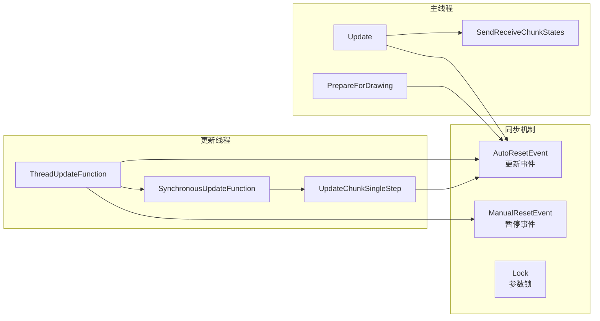

### 3.2 更新位置管理

系统支持多个更新位置（如多人游戏时每个玩家一个）：

```cs
public struct UpdateLocation {
    public Vector2 Center;               // 更新中心
    public Vector2? LastChunksUpdateCenter; // 上次更新中心
    public float VisibilityDistance;     // 可见距离
    public float ContentDistance;        // 内容生成距离
}

// 主线程设置更新位置
SetUpdateLocation(playerIndex, center, visibilityDistance, contentDistance);
```

### 3.3 Chunk 分配与释放

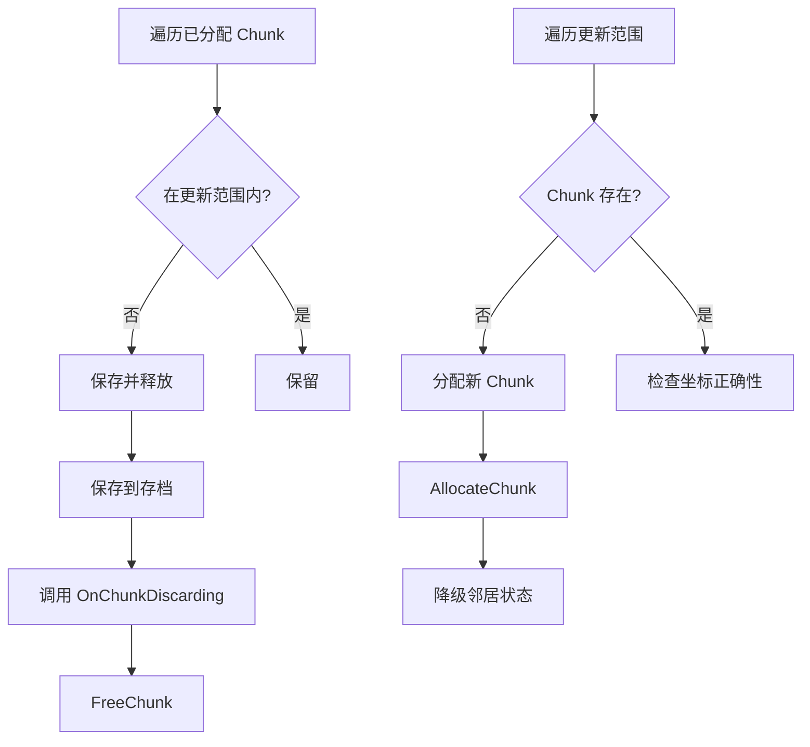

### 3.4 状态更新流程

**单步更新（UpdateChunkSingleStep）**：

```cs
void UpdateChunkSingleStep(TerrainChunk chunk, int skylightValue) {
    switch (chunk.ThreadState) {
        case TerrainChunkState.NotLoaded:
            // 尝试从存档加载
            if (TerrainSerializer.LoadChunk(chunk))
                chunk.ThreadState = TerrainChunkState.InvalidLight;
            else
                chunk.ThreadState = TerrainChunkState.InvalidContents1;
            break;
            
        case TerrainChunkState.InvalidContents1:
            TerrainContentsGenerator.GenerateChunkContentsPass1(chunk);
            chunk.ThreadState = TerrainChunkState.InvalidContents2;
            break;
            
        // ... 其他状态处理
        
        case TerrainChunkState.InvalidVertices1:
            // 等待邻居准备就绪
            CalculateChunkSliceContentsHashes(chunk);
            GenerateChunkVertices(chunk, 0);  // 奇数切片，最终用于渲染
            chunk.ThreadState = TerrainChunkState.InvalidVertices2;
            break;
            
        case TerrainChunkState.InvalidVertices2:
            GenerateChunkVertices(chunk, 1);  // 偶数切片，最终用于渲染
            chunk.NewGeometryData = true;     // 通知渲染器
            chunk.ThreadState = TerrainChunkState.Valid;
            break;
    }
}
```

### 3.5 地形内容生成

`ITerrainContentsGenerator` 接口定义了四阶段生成流程：

```cs
public interface ITerrainContentsGenerator {
    int OceanLevel { get; }
    
    // 环境查询
    Vector3 FindCoarseSpawnPosition();
    float CalculateOceanShoreDistance(float x, float z);
    float CalculateHeight(float x, float z);
    int CalculateTemperature(float x, float z);
    int CalculateHumidity(float x, float z);
    
    // 四阶段生成
    void GenerateChunkContentsPass1(TerrainChunk chunk);  // 地形高度、温度、湿度
    void GenerateChunkContentsPass2(TerrainChunk chunk);  // 细节生成
    void GenerateChunkContentsPass3(TerrainChunk chunk);  // 洞穴、矿物
    void GenerateChunkContentsPass4(TerrainChunk chunk);  // 植被、装饰
}
```

**TerrainContentsGenerator24 生成步骤**：

| Pass | 步骤 | 内容 |
|------|------|------|
| 1 | GenerateSurfaceParameters | 计算温度、湿度（上半部分） |
| 1 | GenerateTerrain | 生成基础地形（上半部分） |
| 2 | GenerateSurfaceParameters | 计算温度、湿度（下半部分） |
| 2 | GenerateTerrain | 生成基础地形（下半部分） |
| 3 | GenerateCaves | 生成洞穴 |
| 3 | GeneratePockets | 生成泥土、沙砾等矿袋 |
| 3 | GenerateMinerals | 生成矿物（煤、铁、钻石等） |
| 3 | GenerateSurface | 生成地表方块 |
| 3 | PropagateFluidsDownwards | 流体向下传播 |
| 4 | GenerateGrassAndPlants | 生成草和植物 |
| 4 | GenerateTrees | 生成树木 |
| 4 | GenerateSnowAndIce | 生成雪和冰 |
| 4 | GenerateBedrockAndAir | 生成基岩和空气 |

### 3.6 光照系统

**阳光计算（GenerateChunkSunLightAndHeight）**：

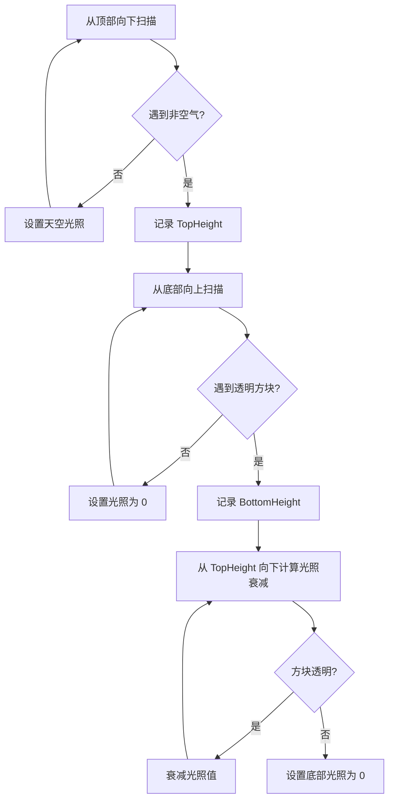

**光源传播**：

```cs
// 收集光源
void GenerateChunkLightSources(TerrainChunk chunk) {
    // 1. 收集方块自身发光源
    // 2. 收集从邻居 Chunk 传播过来的光
}

// 传播光源
void PropagateLightSources() {
    foreach (var lightSource in m_lightSources) {
        // 向 6 个方向传播，遇到透明方块时衰减
        PropagateLightSource(x-1, y, z, light);
        PropagateLightSource(x+1, y, z, light);
        PropagateLightSource(x, y-1, z, light);
        PropagateLightSource(x, y+1, z, light);
        PropagateLightSource(x, y, z-1, light);
        PropagateLightSource(x, y, z+1, light);
    }
}
```

---

## 4. 地形编辑机制

### 4.1 TerrainBrush - 地形画笔

`TerrainBrush` 用于批量编辑地形，支持多种形状：

```cs
public class TerrainBrush {
    public struct Cell {
        public sbyte X, Y, Z;    // 相对坐标
        public int Value;        // 方块值
    }
    
    // 画笔定义
    public class Brush {
        public int m_value;                    // 固定值
        public Func<int?, int?> m_handler1;    // 基于当前值的处理器
        public Func<Point3, int?> m_handler2;  // 基于位置的处理器
    }
    
    // 计数器
    public class Counter {
        public int m_value;                    // 目标值
        public Func<int?, int> m_handler1;     // 基于当前值的计数器
        public Func<Point3, int> m_handler2;   // 基于位置的计数器
    }
    
    private Dictionary<int, Cell> m_cellsDictionary;  // 单元格字典
    private Cell[] m_cells;                           // 编译后的数组
}
```

**关键方法**：

```cs
// 添加单元格
AddCell(x, y, z, brush);
AddBox(x, y, z, sizeX, sizeY, sizeZ, brush);
AddRay(x1, y1, z1, x2, y2, z2, sizeX, sizeY, sizeZ, brush);

// 绘制到地形
PaintFast(chunk, x, y, z);                    // 直接绘制
PaintFastSelective(chunk, x, y, z, onlyValue); // 选择性绘制
PaintFastAvoidWater(chunk, x, y, z);          // 避开水绘制
Paint(subsystemTerrain, x, y, z);             // 带通知绘制
```

### 4.2 SubsystemTerrain 变更接口

```cs
// 修改单个方块（带通知）
void ChangeCell(int x, int y, int z, int value, 
    bool updateModificationCounter = true, MovingBlock movingBlock = null) {
    
    // 1. Mod 钩子
    // 2. 边界检查
    // 3. 比较旧值
    // 4. 设置新值
    // 5. 增加修改计数器
    // 6. 降级邻居 Chunk 状态
    // 7. 记录修改位置
    // 8. 触发方块行为
}

// 破坏方块（带掉落和粒子）
void DestroyCell(int toolLevel, int x, int y, int z, int newValue,
    bool noDrop, bool noParticleSystem, MovingBlock movingBlock = null);
```

**修改通知流程**：

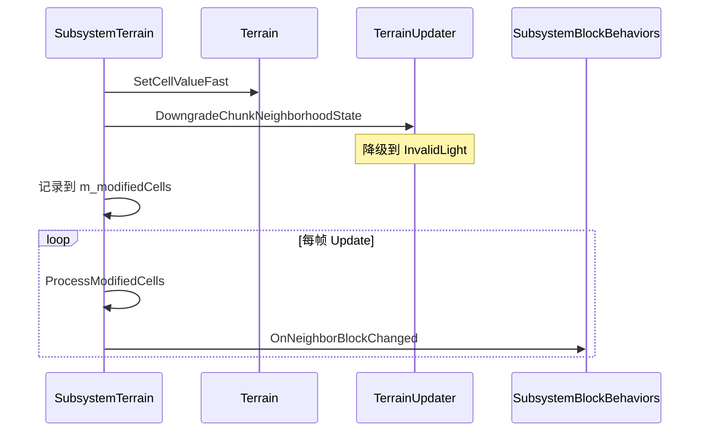

---

## 5. 地形渲染机制

三角形顶点数据在 `TerrainUpdater.GenerateChunkVertices` 方法中生成，它会调用 `Block.GenerateTerrainVertices` 方法来为每个方块生成顶点数据，要查阅特定方块是如何生成它的顶点数据的，请阅读该方块的此方法的源码。

以下是 `TerrainRenderer` 的具体流程

### 5.1 渲染流程

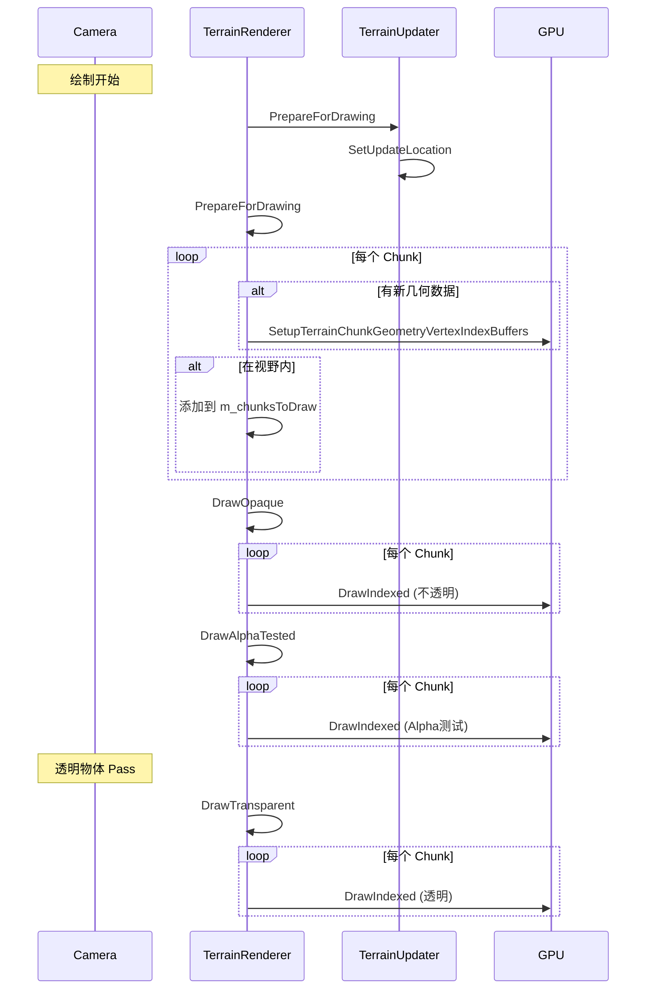

### 5.2 几何数据编译

```cs
static void CompileDrawSubsets(TerrainGeometry[] chunkSliceGeometries,
    DynamicArray<TerrainChunkGeometry.Buffer> buffers) {
    
    // 1. 统计每个纹理的顶点/索引数量
    // 2. 按纹理分组创建 Buffer
    // 3. 设置每个子集在 Buffer 中的范围
    // 4. 将顶点和索引数据写入 GPU Buffer
}
```

**Buffer 结构**：

```cs
public class Buffer : IDisposable {
    public VertexBuffer VertexBuffer;        // 顶点缓冲
    public IndexBuffer IndexBuffer;          // 索引缓冲
    public Texture2D Texture;                // 关联纹理
    
    // 七个子集的范围
    public int[] SubsetIndexBufferStarts = new int[7];
    public int[] SubsetIndexBufferEnds = new int[7];
    public int[] SubsetVertexBufferStarts = new int[7];
    public int[] SubsetVertexBufferEnds = new int[7];
}
```

### 5.3 渲染状态

| Pass | 混合模式 | 深度测试 | 剔除模式 | Shader |
|------|----------|----------|----------|--------|
| DrawOpaque | Opaque | 读写 | 逆时针剔除 | Opaque.vsh/psh |
| DrawAlphaTested | Opaque | 读写 | 逆时针剔除 | AlphaTested.vsh/psh |
| DrawTransparent | AlphaBlend | 读写 | 水下顺时针 | Transparent.vsh/psh |

### 5.4 面剔除优化

```cs
// 根据相机位置确定需要渲染的子集
int subsetsMask = 16;  // 默认渲染中心子集

if (viewPosition.Z > chunk.BoundingBox.Min.Z) subsetsMask |= 1;  // +Z 面
if (viewPosition.X > chunk.BoundingBox.Min.X) subsetsMask |= 2;  // +X 面
if (viewPosition.Z < chunk.BoundingBox.Max.Z) subsetsMask |= 4;  // -Z 面
if (viewPosition.X < chunk.BoundingBox.Max.X) subsetsMask |= 8;  // -X 面

DrawTerrainChunkGeometrySubsets(shader, chunk, subsetsMask);
```

### 5.5 Chunk 淡入效果

```cs
// 开始淡入
void StartChunkFadeIn(Camera camera, TerrainChunk chunk) {
    // 计算 Chunk 四角到相机的最小距离
    float hazeEnd = Math.Min(distances);
    chunk.HazeEnds[gameWidgetIndex] = hazeEnd;
}

// 逐帧淡入
void RunChunkFadeIn(Camera camera, TerrainChunk chunk) {
    chunk.HazeEnds[gameWidgetIndex] += 32f * Time.FrameDuration;
    if (hazeEnd >= VisibilityRange) {
        // 淡入完成
    }
}
```

---

## 6. 地形序列化与存储

### 6.1 存储架构

系统支持两种存储方式：

```cs
public interface IStorage : IDisposable {
    void Open(string directoryName, string suffix);
    int Load(Point2 coords, byte[] buffer);
    void Save(Point2 coords, byte[] buffer, int size);
}
```

| 存储方式 | 文件结构 | 特点 |
|----------|----------|------|
| **SingleFileStorage** | Chunks32fs.dat | 单文件，节点链表结构 |
| **RegionFileStorage** | Regions/Region X,Y.dat | 区域文件，每文件 256 个 Chunk |

**默认使用 RegionFileStorage**，结构如下：

```
World/
└── Regions/
    ├── Region 0,0.dat     # 包含 (0,0) 到 (15,15) 的 Chunk
    ├── Region 0,1.dat
    ├── Region 1,0.dat
    └── ...
```

### 6.2 数据压缩


**RLE 编码格式**：

```cs
// 短格式（count ≤ 15）：4 字节
// | Light = count-1 | Data | Contents |

// 长格式（count > 15）：5 字节
// | Light = 15 | Data | Contents | extraCount = count - 16 |
```

**压缩示例**：

```cs
int CompressChunkData(TerrainChunk chunk, byte[] buffer) {
    // 1. 写入 Shaft 数据（温度/湿度）
    for (int i = 0; i < 16; i++) {
        for (int j = 0; j < 16; j++) {
            int shaft = chunk.GetShaftValueFast(i, j);
            buffer[pos++] = (byte)((temperature << 4) | humidity);
        }
    }
    
    // 2. RLE 编码单元格数据
    // 3. Deflate 压缩
    return Deflate(compressBuffer, 0, pos, outputBuffer);
}
```

### 6.3 增量保存

```cs
void SaveChunk(TerrainChunk chunk) {
    if (chunk.State > InvalidContents4 && chunk.ModificationCounter > 0) {
        SaveChunkData(chunk);
        chunk.ModificationCounter = 0;
    }
}
```

只保存修改过的 Chunk，避免重复写入。

---

## 7. 核心流程图

### 7.1 完整更新流程

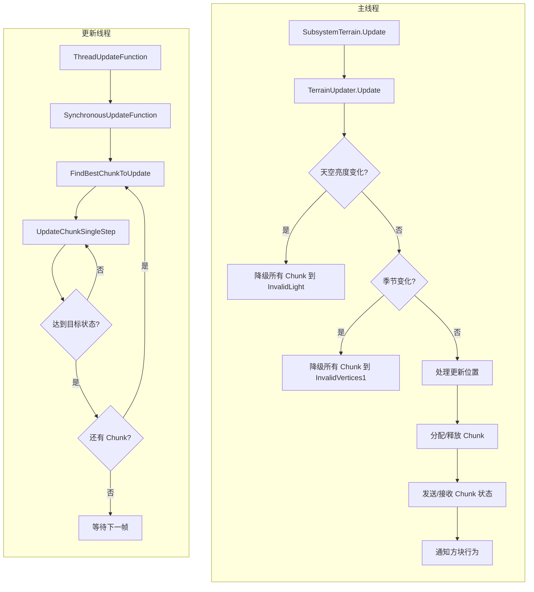

### 7.2 Chunk 生命周期

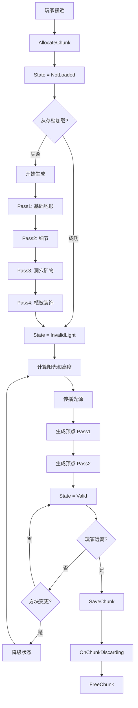

### 7.3 方块变更流程

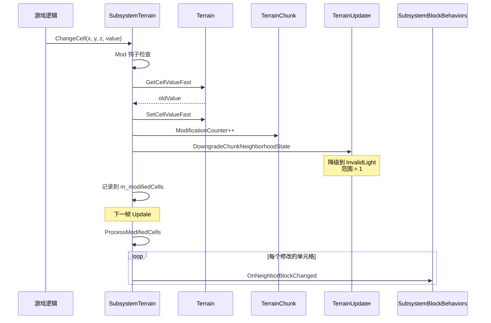

---

## 附录：关键类关系图

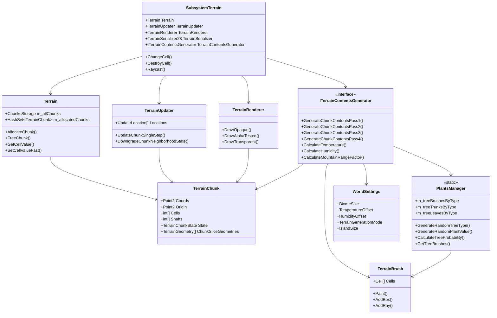

---

## 8. 生物群系生成机制

Survivalcraft 没有显式的 "Biome" 类，而是通过**温度、湿度、山地因子**等参数的组合来隐式定义不同类型的地形区域。这种设计使得生物群系之间的过渡更加自然平滑。

### 8.1 核心环境参数

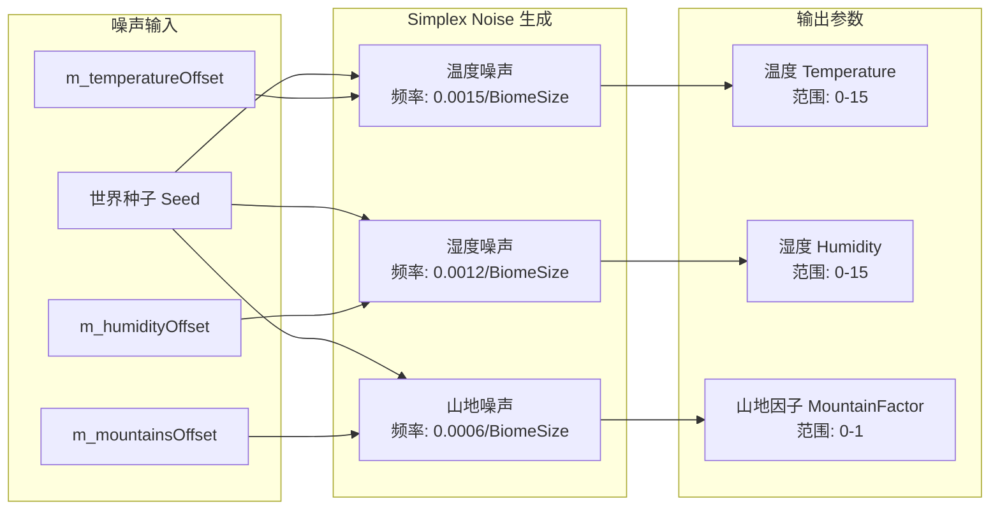

#### 参数计算公式

```cs
// 温度计算 (值范围 0-15)
int CalculateTemperature(float x, float z) {
    return Math.Clamp(
        (int)(MathUtils.Saturate(
            3f * SimplexNoise.OctavedNoise(
                x + m_temperatureOffset.X, 
                z + m_temperatureOffset.Y, 
                0.0015f / TGBiomeScaling,  // 频率
                5,                          // octave 数
                2f,                         // 振幅倍增
                0.6f                        // 持久度
            ) - 1.1f + m_worldSettings.TemperatureOffset / 16f
        ) * 16f),
        0, 15
    );
}

// 湿度计算 (值范围 0-15)
int CalculateHumidity(float x, float z) {
    return Math.Clamp(
        (int)(MathUtils.Saturate(
            3f * SimplexNoise.OctavedNoise(
                x + m_humidityOffset.X, 
                z + m_humidityOffset.Y, 
                0.0012f / TGBiomeScaling,
                5, 2f, 0.6f
            ) - 0.9f + m_worldSettings.HumidityOffset / 16f
        ) * 16f),
        0, 15
    );
}

// 山地因子计算 (值范围 0-1)
float CalculateMountainRangeFactor(float x, float z) {
    return SimplexNoise.OctavedNoise(
        x + m_mountainsOffset.X,
        z + m_mountainsOffset.Y,
        TGMountainRangeFreq / TGBiomeScaling,  // 默认 0.0006/BiomeSize
        3, 1.91f, 0.75f, true
    );
}
```

#### 可调参数（WorldSettings）

| 参数 | 说明 | 默认值 |
|------|------|--------|
| `BiomeSize` | 生物群系大小倍率 | 1.0 |
| `TemperatureOffset` | 全局温度偏移 | 0 |
| `HumidityOffset` | 全局湿度偏移 | 0 |

### 8.2 生物群系类型与条件

游戏通过参数组合隐式定义以下生物群系类型：

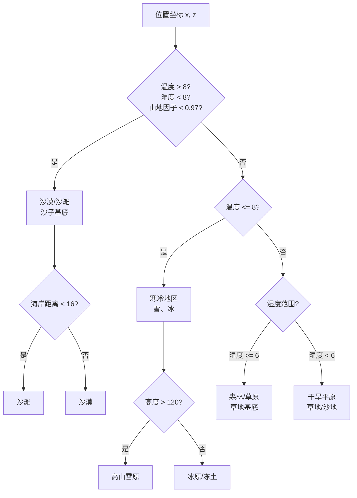

#### 生物群系判定逻辑

| 生物群系 | 温度 | 湿度 | 山地因子 | 其他条件 |
|----------|------|------|----------|----------|
| **沙漠** | > 8 | < 8 | < 0.97 | 距海 > 16 格 |
| **沙滩** | > 8 | < 8 | < 0.97 | 距海 ≤ 16 格 |
| **冰原** | ≤ 8 | 任意 | 任意 | 高度 ≤ 120 |
| **高山雪原** | ≤ 8 | 任意 | 任意 | 高度 > 120 |
| **森林** | 4-15 | ≥ 6 | < 0.9 | - |
| **草原** | 4-15 | ≥ 6 | ≥ 0.9 | - |
| **干旱平原** | > 4 | < 6 | < 0.9 | - |

### 8.3 地表方块生成

在 `GenerateSurface` 方法中，根据环境参数决定地表方块类型：

```cs
void GenerateSurface(TerrainChunk chunk) {
    // 遍历每个水平位置
    for (int i = 0; i < 16; i++) {
        for (int j = 0; j < 16; j++) {
            int temperature = terrain.GetTemperature(x, z);
            int humidity = terrain.GetHumidity(x, z);
            
            // 根据温度和高度决定地表方块
            if (height > 120 && IsPlaceFrozen(temperature, height)) {
                surfaceBlock = 62;  // 冰
            }
            else if (temperature > 4 && temperature < 7) {
                surfaceBlock = 6;   // 沙砾（过渡带）
            }
            else {
                surfaceBlock = 7;   // 沙子（沙漠）
            }
            // ... 更多条件
        }
    }
}
```

**方块 ID 对照表**：

| ID | 方块 | 生成条件 |
|----|------|----------|
| 2 | 草地 | 默认地表 |
| 3 | 泥土 | 地下 |
| 4 | 沙子 | 沙漠/海岸 |
| 6 | 沙砾 | 过渡带 |
| 7 | 沙子（沙漠） | 高温低湿 |
| 8 | 草地（高草） | 高湿度 |
| 61 | 雪 | 寒冷地表 |
| 62 | 冰 | 寒冷水域 |
| 66 | 沙岩 | 特殊条件 |
| 72 | 湿沙 | 水边 |

### 8.4 植被生成

植被生成在 Pass 4 中进行，根据温度和湿度选择合适的植被类型。

#### 树木类型选择

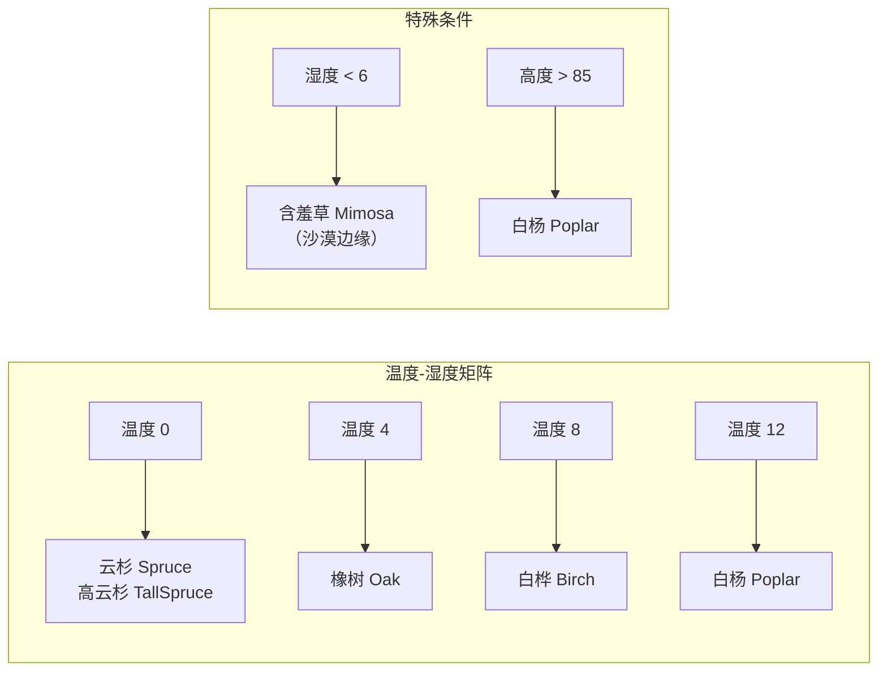

#### 树木生成概率函数

`PlantsManager.CalculateTreeProbability` 定义了每种树木的生成概率：

| 树类型 | 温度范围 | 湿度范围 | 高度范围 | 特点 |
|--------|----------|----------|----------|------|
| **Oak 橡树** | 4-10 最佳 | 6+ | < 82 | 温暖湿润地区 |
| **Birch 白桦** | 5-11 | 任意 | < 82 | 温带地区 |
| **Spruce 云杉** | 0-6（寒冷） | 3-12 | 任意 | 寒冷地区 |
| **TallSpruce 高云杉** | 0-6 | 9-15 | < 95 | 高海拔湿润寒冷 |
| **Mimosa 含羞草** | 2-12 | 0-4 | 任意 | 干旱温暖地区 |
| **Poplar 白杨** | 4-12 | 3+ | 85-92 | 中高海拔 |

```cs
// 概率计算示例：橡树
float CalculateTreeProbability(TreeType.Oak, int temperature, int humidity, int y) {
    return RangeProbability(temperature, 4f, 10f, 15f, 15f)  // 温度 4-10 最佳
         * RangeProbability(humidity, 6f, 8f, 15f, 15f)      // 湿度 6+ 最佳
         * RangeProbability(y, 0f, 0f, 82f, 87f);            // 高度 < 82
}

// RangeProbability: 梯形概率函数
// v < a: 0
// a <= v < b: 线性增长 0→1
// b <= v <= c: 1 (最佳区)
// c < v <= d: 线性下降 1→0
// v > d: 0
```

#### 其他植被生成

| 植被类型 | 条件 | 说明 |
|----------|------|------|
| **高草** | 湿度 ≥ 6 | 草地地表 |
| **花** | 湿度 ≥ 6，随机 | 低概率 |
| **仙人掌** | 温度 > 8，湿度 < 6 | 沙漠地区 |
| **南瓜** | 温度 > 6，湿度 ≥ 10 | 湿润地区 |
| **海草/海带** | 海岸附近 | 水下植被 |
| **常春藤** | 温度 ≥ 10，湿度 ≥ 10 | 热带湿润地区 |

### 8.5 雪和冰生成

在 `GenerateSnowAndIce` 方法中处理：

```cs
void GenerateSnowAndIce(TerrainChunk chunk) {
    for (int i = 0; i < 16; i++) {
        for (int j = 0; j < 16; j++) {
            int temperature = chunk.GetTemperatureFast(i, j);
            
            // 检查是否冻结（温度 <= 8 且高度足够）
            if (!SubsystemWeather.IsPlaceFrozen(temperature, height)) {
                continue;
            }
            
            if (block is WaterBlock) {
                // 水面结冰
                chunk.SetCellValueFast(i, height, j, 62);  // 冰
                // 可能覆盖雪
                if (ShaftHasSnowOnIce(x, z)) {
                    chunk.SetCellValueFast(i, height + 1, j, 61);  // 雪
                }
            }
            else if (CanSupportSnow(block)) {
                // 陆地覆盖雪
                chunk.SetCellValueFast(i, height + 1, j, 61);  // 雪
            }
        }
    }
}
```

### 8.6 生物群系过渡与平滑

由于使用连续的噪声函数，生物群系之间会自然过渡：

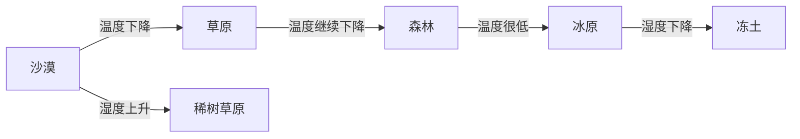

**关键过渡参数**：
- `TGBiomeScaling`：控制噪声频率，值越大生物群系越大
- `m_temperatureOffset` / `m_humidityOffset`：随机偏移，确保每个世界的生物群系分布不同

### 8.7 地形高度与生物群系的关系

```cs
float CalculateHeight(float x, float z) {
    float mountainFactor = CalculateMountainRangeFactor(x, z);
    
    // 山地因子影响地形高度
    float hillsStrength = TGHillsStrength * Squish(mountainFactor, 0.72f, 0.89f);
    float mountainsStrength = TGMountainsStrength * Squish(mountainFactor, 0.89f, 1.0f);
    
    // 湿度影响（湿度高时降低山地）
    float humidityFactor = mountainFactor - 0.01f * humidity;
    
    // 最终高度
    return baseHeight + hillsStrength * hillsNoise + mountainsStrength * mountainsNoise;
}
```

### 8.8 模组扩展点

模组可以通过以下方式自定义生物群系：

1. **TerrainContentsGenerator24Initialize 钩子**：修改生成参数
   ```cs
   public override void TerrainContentsGenerator24Initialize(
       TerrainContentsGenerator24 generator, SubsystemTerrain subsystemTerrain) {
       // 修改参数
       generator.TGBiomeScaling = 2.0f;  // 更大的生物群系
       generator.TGHillsStrength = 50f;  // 更高的丘陵
   }
   ```

2. **添加新的 ChunkGenerationStep**：
   ```cs
   generator.ChunkGenerationStep4.Add(
       new ChunkGenerationStep(1500, chunk => GenerateCustomBiome(chunk))
   );
   ```

3. **PlantsManager 扩展**：添加新的树木类型

---

## 总结

Survivalcraft 的地形系统是一个精心设计的高性能体素引擎，具有以下特点：

1. **分层架构**：数据层、管理层、生成层职责清晰
2. **状态机驱动**：Chunk 通过状态转换实现渐进式加载
3. **多线程更新**：主线程和更新线程通过事件同步
4. **高效存储**：RLE + Deflate 压缩，区域文件组织
5. **灵活渲染**：分 Pass 渲染，支持多种材质和透明度
6. **隐式生物群系**：通过温度/湿度/山地因子组合实现自然的生物群系过渡

理解这些核心机制，有助于进行模组开发、性能优化或功能扩展。
