# UI 界面系统技术文档

本文档详细说明 Survivalcraft 的 UI 界面系统，重点分析组件布局机制、容器组件实现以及布局过程。

## 1. 概述

### 1.1 UI 系统整体架构

游戏的 UI 系统采用经典的**两阶段布局模型**（Measure-Arrange），类似于 WPF/UWP 的布局系统。整个 UI 以树形结构组织，根节点为 `RootWidget`，所有 UI 元素都继承自 `Widget` 基类。

### 1.2 Screen、Dialog、Widget 三者关系

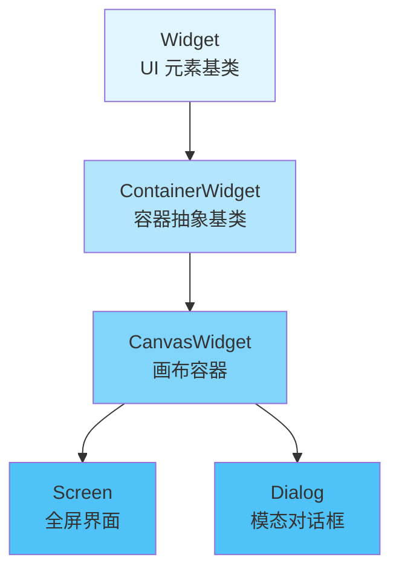

**继承关系说明：**

| 类 | 继承自 | 职责 |
|---|--------|------|
| `Widget` | - | 所有 UI 元素的基类，提供布局、绘制、输入处理的基础设施 |
| `ContainerWidget` | `Widget` | 可包含子元素的容器抽象基类，提供默认的子元素遍历和排列逻辑 |
| `CanvasWidget` | `ContainerWidget` | 支持绝对定位的画布容器，子元素可通过 `SetPosition()` 指定位置 |
| `Screen` | `CanvasWidget` | 全屏界面，具有 `Enter()`/`Leave()` 生命周期方法，由 `ScreensManager` 管理 |
| `Dialog` | `CanvasWidget` | 模态对话框，默认填充整个父容器，由 `DialogsManager` 管理 |

**三者的核心区别：**

| 特性 | Widget | Screen | Dialog |
|------|--------|--------|--------|
| **定位** | UI 元素基类 | 全屏界面状态 | 模态弹出层 |
| **生命周期** | 无 | `Enter()` / `Leave()` | 无 |
| **管理器** | 无 | `ScreensManager` | `DialogsManager` |
| **显示方式** | 作为子元素 | 独占整个屏幕，历史栈导航 | 覆盖在当前 Screen 上 |
| **遮罩层** | 无 | 无 | 有半透明黑色遮罩（CoverWidget） |
| **动画** | 自定义 | 切换时淡入淡出 | 显示/隐藏时缩放动画 |

## 2. Screen 与 Dialog 系统

### 2.1 Screen - 全屏界面

`Screen` 是全屏界面的基类，每个全屏界面一般只有一个实例，由 `ScreensManage` 管理  
定义了两个生命周期方法：

```csharp
public class Screen : CanvasWidget {
    public virtual void Enter(object[] parameters) { }  // 进入屏幕时调用
    public virtual void Leave() { }                       // 离开屏幕时调用
}
```

**主要 Screen 实现类：**

| Screen 类 | 用途 |
|-----------|------|
| `MainMenuScreen` | 主菜单 |
| `GameScreen` | 世界列表与游玩 |
| `LoadingScreen` | 游戏加载 |
| `GameLoadingScreen` | 存档加载 |
| `SettingsScreen` | 设置界面 |

### 2.2 Dialog - 模态对话框

`Dialog` 是模态对话框的基类，一般在需要弹出时临时实例化，由 `DialogsManager` 管理

```csharp
public class Dialog : CanvasWidget {
    public Dialog() {
        IsHitTestVisible = true;
        Size = new Vector2(1f / 0f);  // float.PositiveInfinity，填充整个父容器
    }
}
```

**主要 Dialog 实现类：**

| Dialog 类 | 用途 |
|-----------|------|
| `MessageDialog` | 消息提示对话框 |
| `GameMenuDialog` | 游戏内暂停菜单 |
| `BusyDialog` | 繁忙等待对话框 |
| `ListSelectionDialog` | 列表选择对话框 |
| `TextBoxDialog` | 文本输入对话框 |

### 2.3 ScreensManager - 全屏界面管理器

`ScreensManager` 是静态类，负责管理所有 Screen 的注册、切换、导航历史和切换动画。

**核心数据结构：**

```csharp
public static class ScreensManager {
    static Dictionary<string, Screen> m_screens = [];   // 已注册的屏幕
    static AnimationData m_animationData;               // 当前动画数据
    
    public static ContainerWidget RootWidget { get; set; }  // UI 根容器
    public static Screen CurrentScreen { get; set; }        // 当前屏幕
    public static Screen PreviousScreen { get; set; }       // 上一个屏幕
    public static Stack<Screen> HistoryStack { get; }       // 导航历史栈
}
```

**Screen 切换流程：**

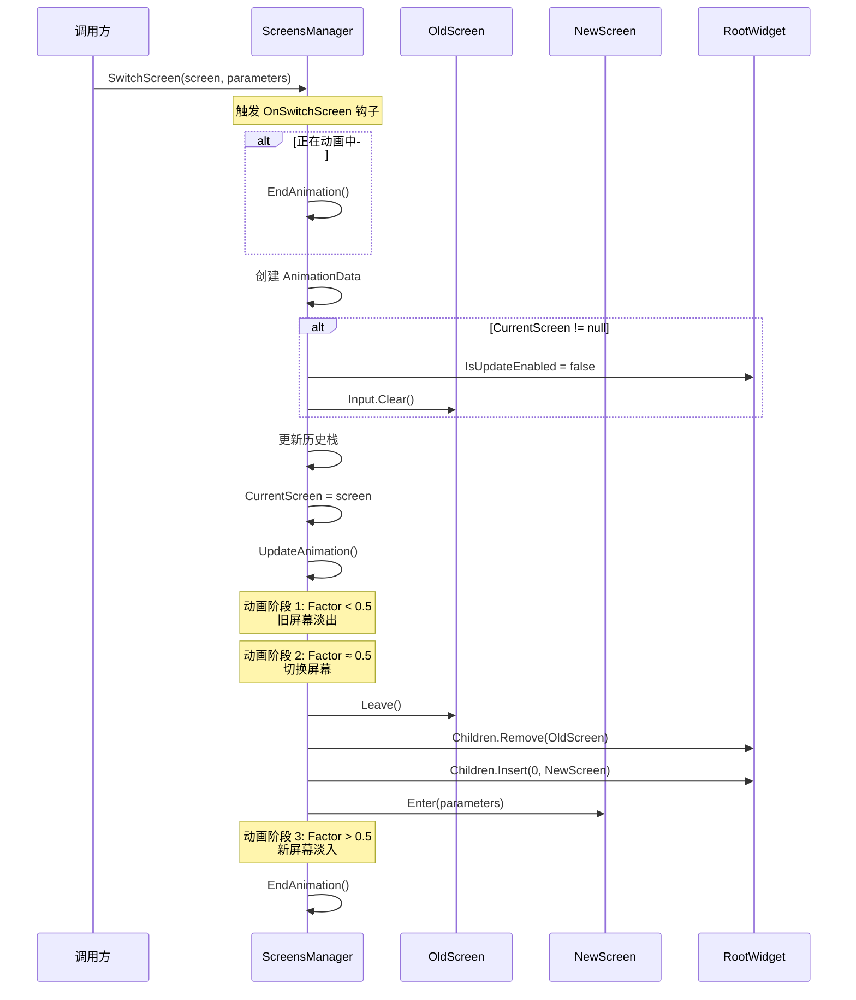

**切换动画机制：**

切换动画分为三个阶段（`Factor` 从 0 到 1）：

1. **Factor < 0.5**：旧屏幕淡出
   - 透明度从 1 渐变到 0
   - 可选缩放变换

2. **Factor ≈ 0.5**：实际切换
   - 调用旧屏幕的 `Leave()`
   - 从 `RootWidget` 移除旧屏幕
   - 添加新屏幕到 `RootWidget`
   - 调用新屏幕的 `Enter(parameters)`

3. **Factor > 0.5**：新屏幕淡入
   - 透明度从 0 渐变到 1

**导航历史栈：**

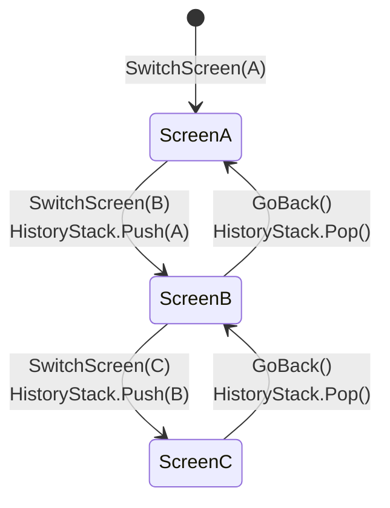

### 2.4 DialogsManager - 对话框管理器

`DialogsManager` 是静态类，负责管理 Dialog 的显示、隐藏和动画效果。

**核心数据结构：**

```csharp
public static class DialogsManager {
    static Dictionary<Dialog, AnimationData> m_animationData = [];  // Dialog 动画数据
    static List<Dialog> m_dialogs = [];          // 当前显示的 Dialog 列表
    static List<Dialog> m_toRemove = [];         // 待移除列表
    
    public class AnimationData {
        public float Factor;        // 动画进度因子 (0~1)
        public int Direction;       // 方向：1=显示，-1=隐藏
        public CoverWidget CoverWidget;  // 遮罩层
    }
}
```

**Dialog 显示流程：**

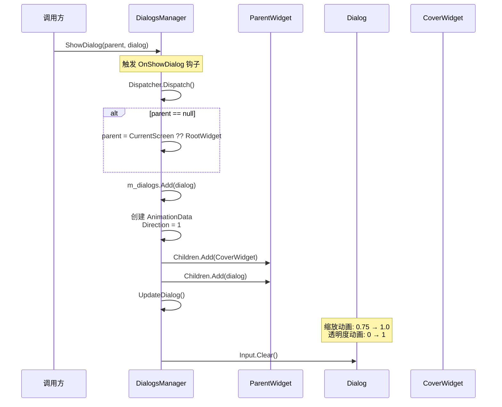

**Dialog 隐藏流程：**

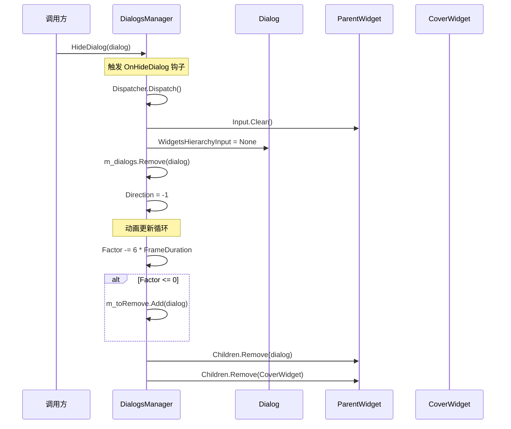

**遮罩层（CoverWidget）机制：**

每个 Dialog 都关联一个 `CoverWidget`，它是一个半透明黑色矩形（`FillColor = Color(0, 0, 0, 192)`），具有以下作用：

1. **模态遮罩**：阻止用户与底层 Screen 交互
2. **视觉反馈**：提供半透明背景突出 Dialog
3. **点击关闭**：设置 `IsHitTestVisible = true`，可检测点击事件

## 3. 布局系统核心概念

### 3.1 Measure-Arrange 两阶段布局模型

布局过程分为两个阶段：

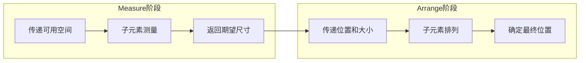

**Measure 阶段（测量）：**
- 父元素向子元素传递**可用空间**（`parentAvailableSize`）
- 子元素根据内容和约束计算**期望尺寸**（`DesiredSize`）
- 返回期望尺寸给父元素

**Arrange 阶段（排列）：**
- 父元素根据子元素的期望尺寸和自身布局策略，确定子元素的**实际位置和大小**
- 子元素接收位置和大小，计算全局变换矩阵和边界

### 3.2 关键属性

| 属性 | 说明 |
|------|------|
| `DesiredSize` | Widget 期望的尺寸，在 Measure 阶段计算 |
| `ParentDesiredSize` | 考虑 LayoutTransform 后的期望尺寸，供父元素使用 |
| `ActualSize` | Widget 的实际尺寸，在 Arrange 阶段确定 |
| `GlobalBounds` | Widget 在屏幕坐标系中的边界矩形 |
| `Margin` | Widget 的外边距（Left、Top、Right、Bottom） |

### 3.3 对齐方式

`WidgetAlignment` 枚举定义了四种对齐方式：

```csharp
public enum WidgetAlignment {
    Near,     // 近端对齐（左/上）
    Center,   // 居中对齐
    Far,      // 远端对齐（右/下）
    Stretch   // 拉伸填充
}
```

**对齐行为示意：**

```
┌─────────────────────────────┐
│ Near                        │  ← 靠左/上
├─────────────────────────────┤
│         Center              │  ← 居中
├─────────────────────────────┤
│                       Far   │  ← 靠右/下
├─────────────────────────────┤
│─────────────────────────────│  ← 拉伸填充
└─────────────────────────────┘
```

### 3.4 布局方向

`LayoutDirection` 枚举定义了两种布局方向：

```csharp
public enum LayoutDirection {
    Horizontal,  // 水平方向
    Vertical     // 垂直方向
}
```

## 4. Widget 基类实现

### 4.1 布局入口

`LayoutWidgetsHierarchy` 是布局的静态入口方法：

```csharp
public static void LayoutWidgetsHierarchy(Widget rootWidget, Vector2 availableSize) {
    rootWidget.Measure(availableSize);           // 测量阶段
    rootWidget.Arrange(Vector2.Zero, availableSize);  // 排列阶段
}
```

### 4.2 Measure 方法

```csharp
public virtual void Measure(Vector2 parentAvailableSize) {
    MeasureOverride(parentAvailableSize);  // 子类重写以自定义测量逻辑
    
    // 考虑 LayoutTransform 对期望尺寸的影响
    if (DesiredSize.X != float.PositiveInfinity && DesiredSize.Y != float.PositiveInfinity) {
        BoundingRectangle boundingRectangle = TransformBoundsToParent(DesiredSize);
        m_parentDesiredSize = boundingRectangle.Size();
        m_parentOffset = -boundingRectangle.Min;
    } else {
        m_parentDesiredSize = DesiredSize;
        m_parentOffset = Vector2.Zero;
    }
}

public virtual void MeasureOverride(Vector2 parentAvailableSize) { }
```

### 4.3 Arrange 方法

```csharp
public virtual void Arrange(Vector2 position, Vector2 parentActualSize) {
    // 计算实际尺寸（考虑 LayoutTransform）
    m_actualSize = ...;
    
    // 计算全局颜色变换
    m_globalColorTransform = ParentWidget != null 
        ? ParentWidget.m_globalColorTransform * m_colorTransform 
        : m_colorTransform;
    
    // 计算全局变换矩阵
    if (m_isRenderTransformIdentity) {
        m_globalTransform = m_layoutTransform;
    } else {
        m_globalTransform = m_renderTransform * m_layoutTransform;
    }
    m_globalTransform.M41 += position.X + m_parentOffset.X;
    m_globalTransform.M42 += position.Y + m_parentOffset.Y;
    if (ParentWidget != null) {
        m_globalTransform *= ParentWidget.GlobalTransform;
    }
    
    // 计算全局边界
    m_globalBounds = TransformBoundsToGlobal(m_actualSize);
    
    ArrangeOverride();  // 子类重写以自定义排列逻辑
}

public virtual void ArrangeOverride() { }
```

### 4.4 变换矩阵

Widget 支持两种变换矩阵：

| 变换 | 说明 | 影响阶段 |
|------|------|----------|
| `LayoutTransform` | 布局变换 | Measure 和 Arrange |
| `RenderTransform` | 渲染变换 | 仅 Draw |

**全局变换矩阵的计算顺序：**

```
GlobalTransform = RenderTransform × LayoutTransform × ParentGlobalTransform
```

## 5. ContainerWidget 容器基类

`ContainerWidget` 是所有容器组件的抽象基类，提供子元素管理和默认布局行为。

### 5.1 子元素管理

```csharp
public abstract class ContainerWidget : Widget {
    public readonly WidgetsList Children;  // 子元素集合
    
    public IEnumerable<Widget> AllChildren { get; }  // 递归获取所有子元素
}
```

`WidgetsList` 是专门的子元素集合类，在添加/移除子元素时会自动设置 `ParentWidget` 属性。

### 5.2 默认测量行为

```csharp
public override void MeasureOverride(Vector2 parentAvailableSize) {
    foreach (Widget child in Children) {
        child.Measure(Vector2.Max(
            parentAvailableSize - child.MarginHorizontalSumAndVerticalSum, 
            Vector2.Zero
        ));
    }
}
```

默认行为：遍历所有子元素，传递减去 Margin 后的可用空间。

### 5.3 默认排列行为

```csharp
public override void ArrangeOverride() {
    foreach (Widget child in Children) {
        ArrangeChildWidgetInCell(Vector2.Zero, ActualSize, child);
    }
}
```

默认行为：遍历所有子元素，使用容器的整个区域进行排列。

### 5.4 ArrangeChildWidgetInCell 方法详解

这是容器排列子元素的核心方法，处理对齐逻辑：

```csharp
public static void ArrangeChildWidgetInCell(Vector2 c1, Vector2 c2, Widget widget) {
    // c1: 单元格左上角, c2: 单元格右下角
    Vector2 cellSize = c2 - c1;
    Vector2 desiredSize = widget.ParentDesiredSize;
    
    // 限制期望尺寸不超过单元格大小
    if (float.IsPositiveInfinity(desiredSize.X) || desiredSize.X > cellSize.X - widget.MarginHorizontalSum) {
        desiredSize.X = MathUtils.Max(cellSize.X - widget.MarginHorizontalSum, 0f);
    }
    if (float.IsPositiveInfinity(desiredSize.Y) || desiredSize.Y > cellSize.Y - widget.MarginVerticalSum) {
        desiredSize.Y = MathUtils.Max(cellSize.Y - widget.MarginVerticalSum, 0f);
    }
    
    // 水平对齐
    Vector2 position, size;
    switch (widget.HorizontalAlignment) {
        case WidgetAlignment.Near:
            position.X = c1.X + widget.MarginLeft;
            size.X = desiredSize.X;
            break;
        case WidgetAlignment.Center:
            position.X = c1.X + (cellSize.X - desiredSize.X) / 2f;
            size.X = desiredSize.X;
            break;
        case WidgetAlignment.Far:
            position.X = c2.X - desiredSize.X - widget.MarginRight;
            size.X = desiredSize.X;
            break;
        case WidgetAlignment.Stretch:
            position.X = c1.X + widget.MarginLeft;
            size.X = MathUtils.Max(cellSize.X - widget.MarginHorizontalSum, 0f);
            break;
    }
    
    // 垂直对齐（类似逻辑）...
    
    widget.Arrange(position, size);
}
```

**对齐逻辑流程图：**

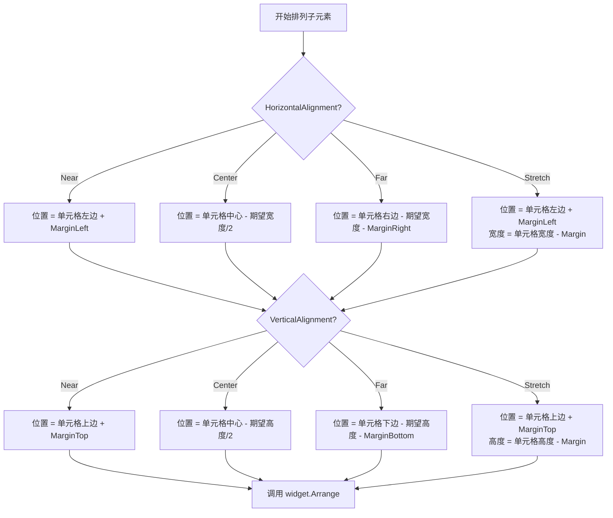

## 6. 容器组件详解

### 6.1 CanvasWidget - 画布容器（绝对定位）

`CanvasWidget` 支持通过 `SetPosition()` 方法为子元素设置绝对位置。

**核心实现：**

```csharp
public class CanvasWidget : ContainerWidget {
    public Dictionary<Widget, Vector2> m_positions = [];  // 子元素位置映射
    public Vector2 Size { get; set; } = new(-1f);         // 容器固定尺寸
    
    public static void SetPosition(Widget widget, Vector2 position) {
        (widget.ParentWidget as CanvasWidget)?.SetWidgetPosition(widget, position);
    }
}
```

**测量逻辑：**

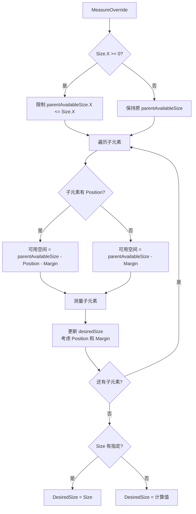

**排列逻辑：**

```mermaid
flowchart TD
    A[ArrangeOverride] --> B[遍历子元素]
    B --> C{子元素有 Position?}
    
    C -->|是| D{期望尺寸有限?}
    D -->|是| E[size = ParentDesiredSize]
    D -->|否| F[size = ActualSize - Position]
    
    E --> G[Arrange(Position, size)]
    F --> G
    
    C -->|否| H[ArrangeChildWidgetInCell<br/>使用默认对齐]
    
    G --> I{还有子元素?}
    H --> I
    I -->|是| B
    I -->|否| J[结束]
```

### 6.2 StackPanelWidget - 栈面板

`StackPanelWidget` 按水平或垂直方向依次排列子元素，支持固定尺寸和填充模式。

**核心实现：**

```csharp
public class StackPanelWidget : ContainerWidget {
    public float m_fixedSize;   // 固定尺寸子元素的总尺寸
    public int m_fillCount;     // 需要填充的子元素数量
    
    public LayoutDirection Direction { get; set; }
    public bool IsInverted { get; set; }  // 是否反向排列
}
```

**测量逻辑（以水平方向为例）：**

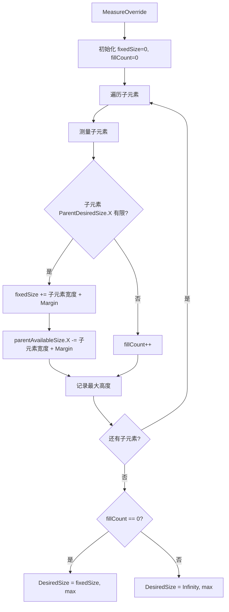

**排列逻辑（以水平方向为例）：**

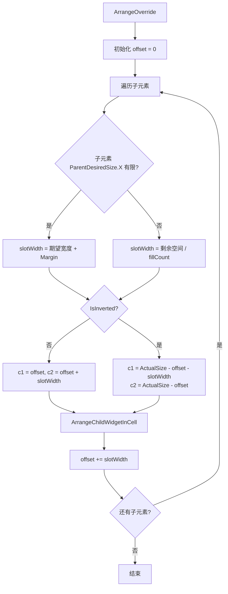

**填充模式示例：**

```
假设容器宽度 300px，有三个子元素：
- 子元素 A: 期望宽度 100px (固定)
- 子元素 B: 期望宽度 Infinity (填充)
- 子元素 C: 期望宽度 Infinity (填充)

计算过程：
- fixedSize = 100
- fillCount = 2
- 每个填充元素宽度 = (300 - 100) / 2 = 100px

最终布局：
┌─────────┬─────────┬─────────┐
│    A    │    B    │    C    │
│  100px  │  100px  │  100px  │
└─────────┴─────────┴─────────┘
```

### 6.3 GridPanelWidget - 网格面板

`GridPanelWidget` 按行列网格排列子元素，每个子元素可指定所在的单元格。

**核心实现：**

```csharp
public class GridPanelWidget : ContainerWidget {
    public class Column {
        public float Position;      // 列起始位置
        public float ActualWidth;   // 列实际宽度
    }
    
    public class Row {
        public float Position;      // 行起始位置
        public float ActualHeight;  // 行实际高度
    }
    
    public List<Column> m_columns = [];
    public List<Row> m_rows = [];
    public Dictionary<Widget, Point2> m_cells = [];  // 子元素单元格映射
    
    public static void SetCell(Widget widget, Point2 cell) {
        (widget.ParentWidget as GridPanelWidget)?.SetWidgetCell(widget, cell);
    }
}
```

**测量逻辑：**

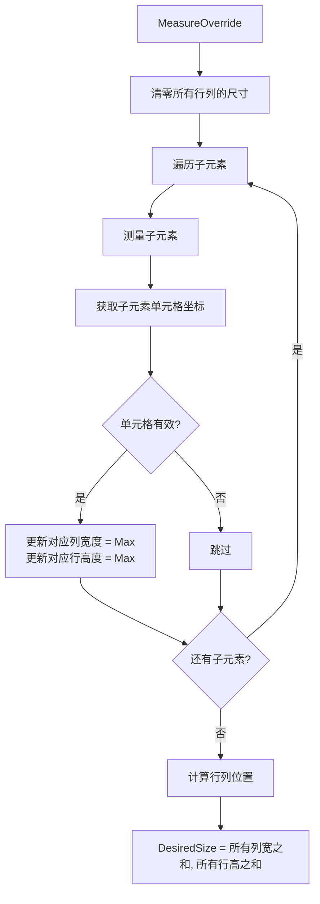

**排列逻辑：**

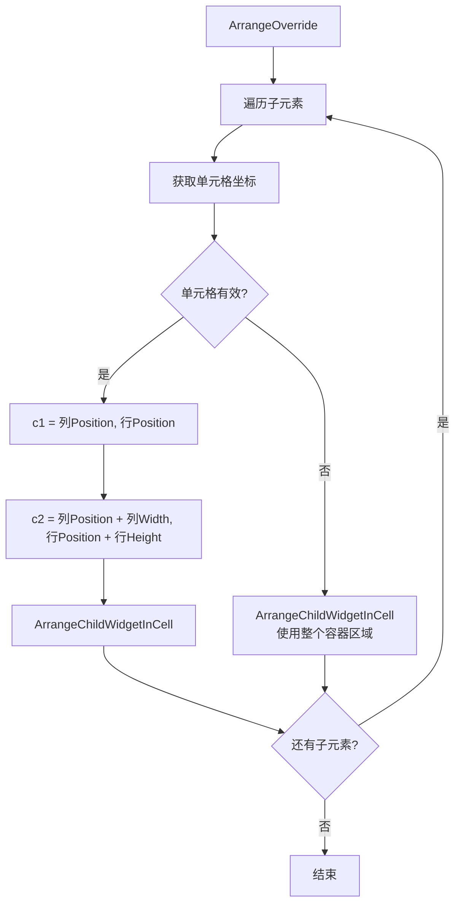

**网格布局示例：**

```
GridPanelWidget (2列 x 2行):
┌─────────────┬─────────────┐
│   (0, 0)    │   (1, 0)    │
│   子元素A   │   子元素B   │
├─────────────┼─────────────┤
│   (0, 1)    │   (1, 1)    │
│   子元素C   │   子元素D   │
└─────────────┴─────────────┘

列宽自动计算为该列最宽子元素的宽度
行高自动计算为该行最高子元素的高度
```

### 6.4 ScrollPanelWidget - 滚动面板

`ScrollPanelWidget` 提供水平或垂直滚动功能，支持惯性滚动和滚动条显示。

**核心实现：**

```csharp
public class ScrollPanelWidget : ContainerWidget {
    public LayoutDirection Direction { get; set; }
    public float ScrollPosition { get; set; }   // 当前滚动位置
    public float ScrollSpeed { get; set; }      // 滚动速度（惯性）
    
    public float m_scrollAreaLength;            // 滚动区域总长度
    public float m_scrollBarAlpha;              // 滚动条透明度
}
```

**测量逻辑：**

```csharp
public override void MeasureOverride(Vector2 parentAvailableSize) {
    foreach (Widget child in Children) {
        if (Direction == LayoutDirection.Horizontal) {
            // 水平滚动：宽度无限，高度受限
            child.Measure(new Vector2(float.MaxValue, parentAvailableSize.Y - child.MarginVerticalSum));
        } else {
            // 垂直滚动：高度无限，宽度受限
            child.Measure(new Vector2(parentAvailableSize.X - child.MarginHorizontalSum, float.MaxValue));
        }
    }
}
```

**排列逻辑：**

```csharp
public override void ArrangeOverride() {
    foreach (Widget child in Children) {
        Vector2 position = Vector2.Zero;
        Vector2 size = ActualSize;
        
        if (Direction == LayoutDirection.Horizontal) {
            position.X -= ScrollPosition;  // 水平偏移
            size.X = position.X + child.ParentDesiredSize.X;
        } else {
            position.Y -= ScrollPosition;  // 垂直偏移
            size.Y = position.Y + child.ParentDesiredSize.Y;
        }
        
        ArrangeChildWidgetInCell(position, size, child);
    }
}
```

**滚动交互逻辑：**

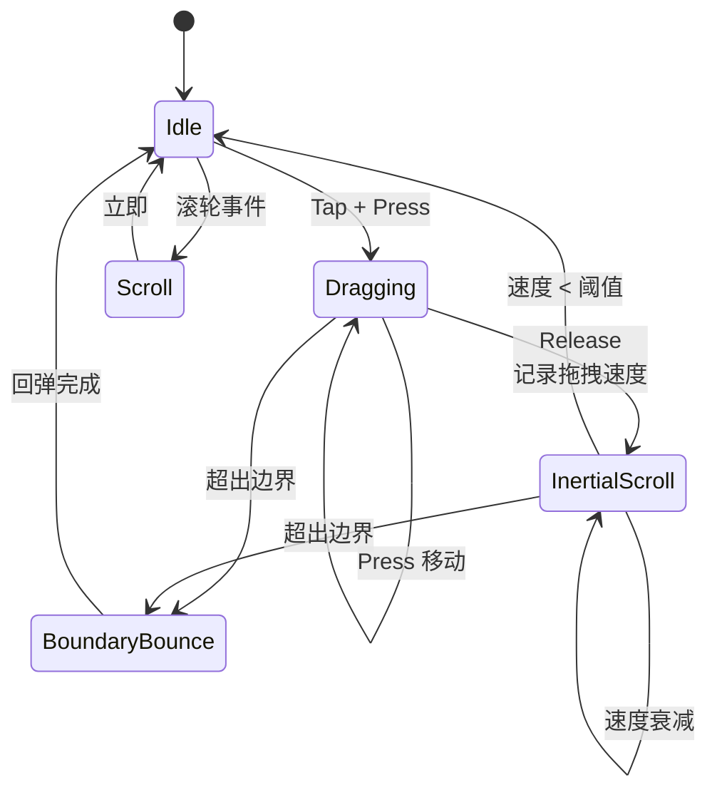

### 6.5 ListPanelWidget - 虚拟化列表面板

`ListPanelWidget` 继承自 `ScrollPanelWidget`，实现了虚拟化渲染——仅创建和排列可见区域的列表项。

**核心实现：**

```csharp
public class ListPanelWidget : ScrollPanelWidget {
    public List<object> m_items = [];                    // 数据项列表
    public Dictionary<int, Widget> m_widgetsByIndex = []; // 索引到 Widget 的映射
    
    public int m_firstVisibleIndex;   // 第一个可见项索引
    public int m_lastVisibleIndex;    // 最后一个可见项索引
    
    public float ItemSize { get; set; }  // 每项的固定尺寸
    public Func<object, Widget> ItemWidgetFactory { get; set; }  // Widget 工厂
}
```

**虚拟化渲染流程：**

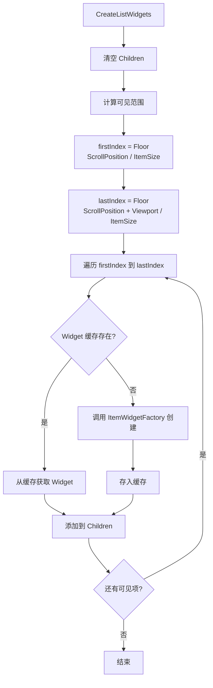

**虚拟化优势：**

```
假设列表有 1000 项，每项高度 48px，视口高度 400px：

传统方式：
- 创建 1000 个 Widget
- 内存占用高
- 布局计算慢

虚拟化方式：
- 仅创建 ceil(400/48) + 1 ≈ 10 个 Widget
- 滚动时复用 Widget
- 内存占用低
- 布局计算快
```

### 6.6 UniformSpacingPanelWidget - 均匀间距面板

`UniformSpacingPanelWidget` 将子元素均匀分布在可用空间内。

**核心实现：**

```csharp
public class UniformSpacingPanelWidget : ContainerWidget {
    public LayoutDirection Direction { get; set; }
    public int m_count;  // 可见子元素数量
}
```

**测量逻辑：**

```csharp
public override void MeasureOverride(Vector2 parentAvailableSize) {
    m_count = Children.Count(c => c.IsVisible);
    
    // 每个子元素分配平均空间
    Vector2 childAvailableSize = Direction == LayoutDirection.Horizontal
        ? new Vector2(parentAvailableSize.X / m_count, parentAvailableSize.Y)
        : new Vector2(parentAvailableSize.X, parentAvailableSize.Y / m_count);
    
    foreach (Widget child in Children) {
        child.Measure(childAvailableSize - child.MarginHorizontalSumAndVerticalSum);
    }
    
    // 期望尺寸为无限（依赖父容器分配空间）
    DesiredSize = Direction == LayoutDirection.Horizontal
        ? new Vector2(float.PositiveInfinity, maxChildHeight)
        : new Vector2(maxChildWidth, float.PositiveInfinity);
}
```

**排列逻辑：**

```csharp
public override void ArrangeOverride() {
    Vector2 offset = Vector2.Zero;
    foreach (Widget child in Children) {
        if (Direction == LayoutDirection.Horizontal) {
            float slotWidth = ActualSize.X / m_count;
            ArrangeChildWidgetInCell(offset, new Vector2(offset.X + slotWidth, ActualSize.Y), child);
            offset.X += slotWidth;
        } else {
            float slotHeight = ActualSize.Y / m_count;
            ArrangeChildWidgetInCell(offset, new Vector2(ActualSize.X, offset.Y + slotHeight), child);
            offset.Y += slotHeight;
        }
    }
}
```

## 7. 布局流程图解

### 7.1 完整布局流程

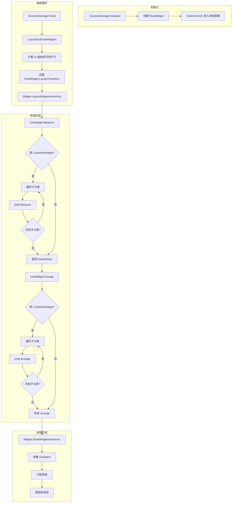

### 7.2 Measure 阶段递归调用链

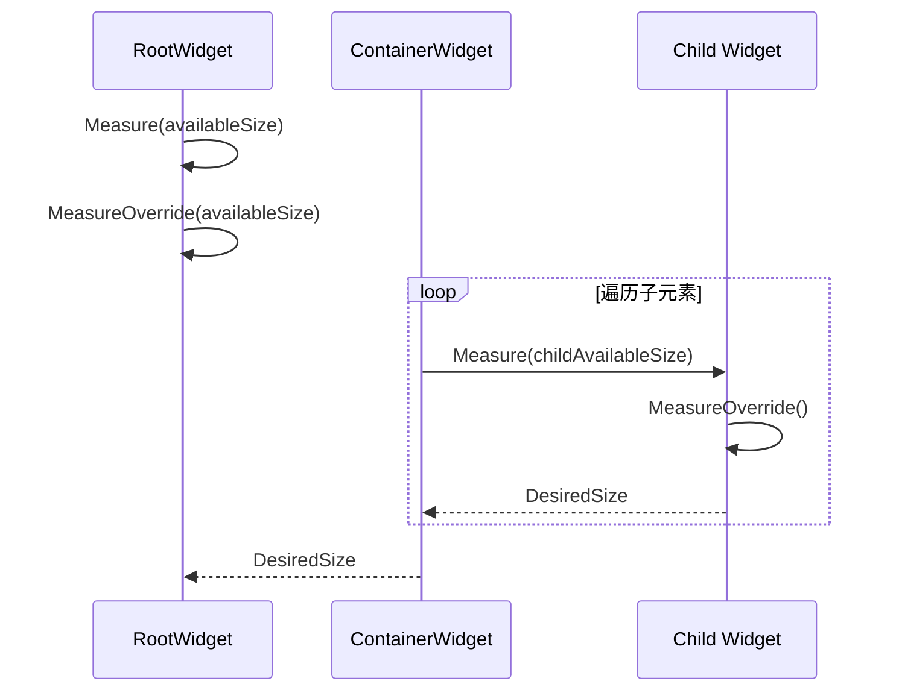

### 7.3 Arrange 阶段递归调用链

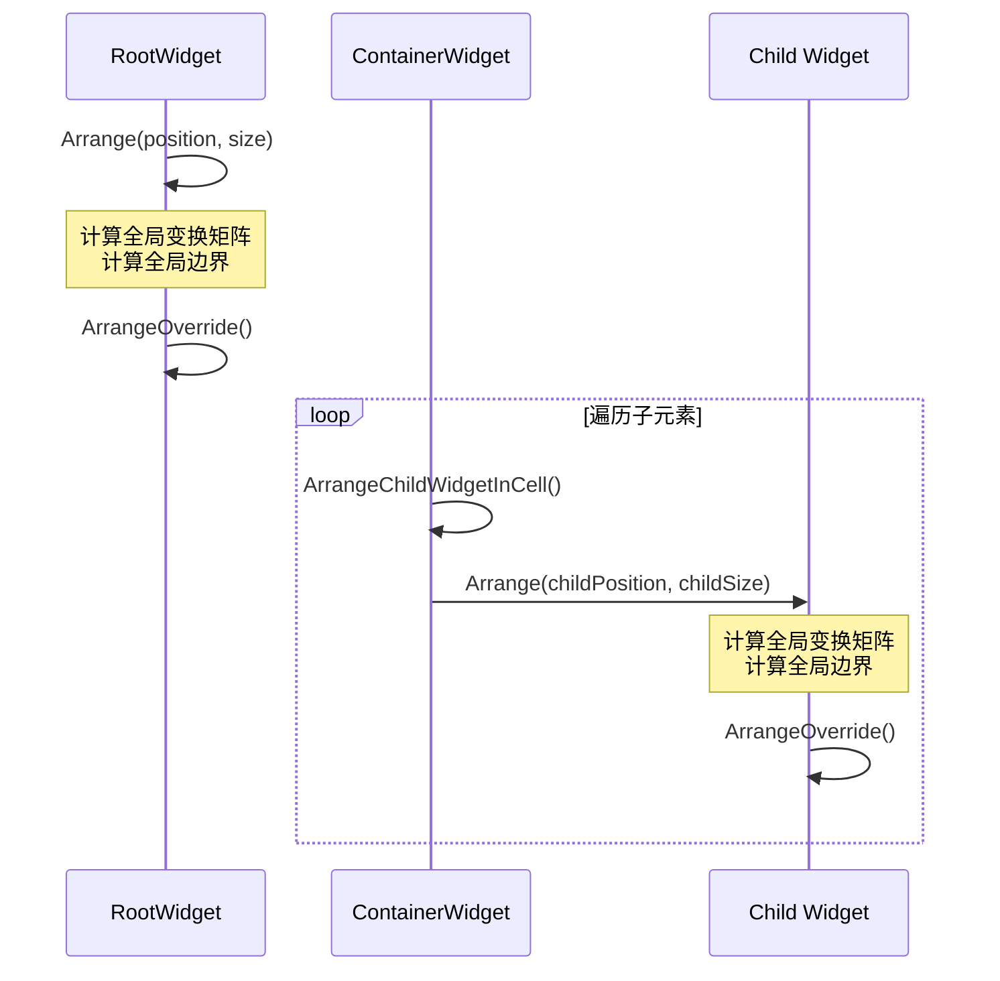

## 8. 更新与绘制系统

### 8.1 UI 主循环流程

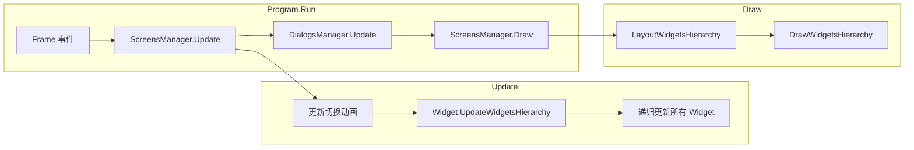

### 8.2 UpdateWidgetsHierarchy

```csharp
public static void UpdateWidgetsHierarchy(Widget rootWidget) {
    if (rootWidget.IsUpdateEnabled) {
        bool isMouseCursorVisible = false;
        UpdateWidgetsHierarchy(rootWidget, ref isMouseCursorVisible);
        Mouse.IsMouseVisible = isMouseCursorVisible;
    }
}

public static void UpdateWidgetsHierarchy(Widget widget, ref bool isMouseCursorVisible) {
    if (!widget.IsVisible || !widget.IsUpdateEnabled || !widget.IsEnabled) {
        return;
    }
    
    // 更新 WidgetInput
    if (widget.WidgetsHierarchyInput != null) {
        widget.WidgetsHierarchyInput.Update();
        isMouseCursorVisible |= widget.WidgetsHierarchyInput.IsMouseCursorVisible;
    }
    
    // 递归更新子元素
    if (widget is ContainerWidget containerWidget) {
        for (int i = containerWidget.Children.Count - 1; i >= 0; i--) {
            UpdateWidgetsHierarchy(containerWidget.Children[i], ref isMouseCursorVisible);
        }
    }
    
    // 调用 Widget 的 Update
    widget.Update();
}
```

### 8.3 DrawContext 与 DrawItem

`DrawContext` 管理整个绘制过程，使用 `DrawItem` 队列实现延迟渲染和层级排序：

```csharp
public class DrawItem : IComparable<DrawItem> {
    public int Layer;              // 层级，值越小越先绘制
    public bool IsOverdraw;        // 是否为 Overdraw 任务
    public Widget Widget;          // 关联的 Widget
    public Rectangle? ScissorRectangle;  // 裁剪区域
}
```

**绘制流程：**

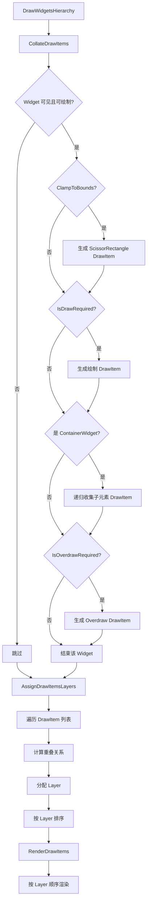

### 8.4 层级排序机制

层级排序确保绘制顺序正确，后绘制的覆盖先绘制的：

```csharp
public virtual void AssignDrawItemsLayers() {
    for (int i = 0; i < m_drawItems.Count; i++) {
        DrawItem drawItem = m_drawItems[i];
        for (int j = i + 1; j < m_drawItems.Count; j++) {
            DrawItem drawItem2 = m_drawItems[j];
            // ScissorRectangle 会增加层级
            if (drawItem.ScissorRectangle.HasValue || drawItem2.ScissorRectangle.HasValue) {
                drawItem2.Layer = Math.Max(drawItem2.Layer, drawItem.Layer + 1);
            }
            // 重叠的 Widget 会增加层级
            else if (TestOverlap(drawItem.Widget, drawItem2.Widget)) {
                drawItem2.Layer = Math.Max(drawItem2.Layer, drawItem.Layer + 1);
            }
        }
    }
    m_drawItems.Sort();  // 按 Layer 升序排序
}
```

## 9. 使用示例

### 9.1 XML 布局定义

UI 可通过 XML 文件定义，存放在 `Content/Assets/Widgets/` 或 `Content/Assets/Screens/` 目录：

```xml
<CanvasWidget xmlns="runtime-namespace:Game" Size="400, 300">
    <LabelWidget Text="标题" HorizontalAlignment="Center" VerticalAlignment="Near" MarginTop="10" />
    <StackPanelWidget Direction="Vertical" Margin="10, 20">
        <ButtonWidget Text="按钮1" MarginBottom="10" />
        <ButtonWidget Text="按钮2" />
    </StackPanelWidget>
</CanvasWidget>
```

### 9.2 代码创建布局

```csharp
CanvasWidget canvas = new CanvasWidget {
    Size = new Vector2(400f, 300f)
};
canvas.AddChildren(new LabelWidget {
    Text = "标题",
    HorizontalAlignment = WidgetAlignment.Center,
    VerticalAlignment = WidgetAlignment.Near,
    MarginTop = 10f
});
StackPanelWidget stackPanel = new StackPanelWidget {
    Direction = LayoutDirection.Vertical,
    Margin = new Vector2(10f, 20f)
};
canvas.AddChildren(stackPanel);
stackPanel.AddChildren(new ButtonWidget {
    Text = "按钮1",
    MarginBottom = 10f
});
stackPanel.AddChildren(new ButtonWidget {
    Text = "按钮2"
});
```

### 9.3 常见布局组合

**居中对话框：**

```xml
<CanvasWidget Size="Infinity">
    <CanvasWidget Size="400, 300" HorizontalAlignment="Center" VerticalAlignment="Center">
        <!-- 对话框内容 -->
    </CanvasWidget>
</CanvasWidget>
```

**底部按钮栏：**

```xml
<CanvasWidget>
    <!-- 主内容区域 -->
    <StackPanelWidget Direction="Horizontal" VerticalAlignment="Far">
        <ButtonWidget Text="确定" HorizontalAlignment="Stretch" />
        <ButtonWidget Text="取消" HorizontalAlignment="Stretch" />
    </StackPanelWidget>
</CanvasWidget>
```

**可滚动列表：**

```xml
<ScrollPanelWidget Direction="Vertical" ClampToBounds="true">
    <StackPanelWidget Direction="Vertical">
        <!-- 列表项 -->
    </StackPanelWidget>
</ScrollPanelWidget>
```
